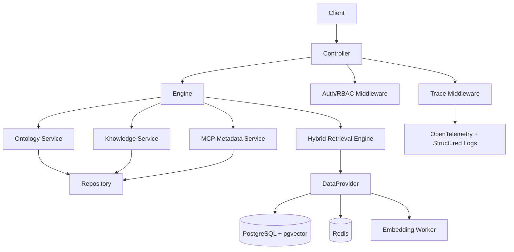

# M1 Architecture Spec

## 1. Scope

M1 only covers:
1. Ontology management
2. Knowledge framework management
3. Metadata MCP APIs
4. Hybrid search
5. Ontology & knowledge management web console page

## 2. Standard Tree

```text
Project_TheWorld/
├── src/
│   └── app/
│       ├── main.py
│       ├── api/v1/
│       │   ├── ontology.py
│       │   ├── knowledge.py
│       │   └── mcp_metadata.py
│       ├── ui/m1_console.html
│       ├── core/{config.py,security.py,logging.py}
│       ├── schemas/{ontology.py,knowledge.py,mcp_metadata.py}
│       ├── domain/
│       │   ├── ontology/{entities.py,rules.py,services.py}
│       │   ├── knowledge/{entities.py,services.py}
│       │   └── retrieval/{query_preprocessor.py,hybrid_engine.py,scorer.py}
│       ├── repositories/{ontology_repo.py,knowledge_repo.py,retrieval_repo.py}
│       ├── services/{ontology_service.py,knowledge_service.py,mcp_metadata_service.py,embedding_service.py}
│       ├── infra/
│       │   ├── db/{base.py,models.py,session.py}
│       │   ├── cache/redis_client.py
│       │   └── embedding/bge_m3_client.py
│       └── workers/embedding_worker.py
├── tests/
│   ├── unit/{test_inheritance_rules.py,test_schema_validation.py,test_hybrid_scoring.py}
│   └── integration/{test_attribute_match_flow.py,test_ontology_detail_flow.py,test_fewshot_retrieval_flow.py,test_m1_console_and_management_flow.py}
├── configs/{dev.yaml,test.yaml,prod.yaml}
├── alembic/{env.py,versions/}
├── requirements.txt
└── README.md
```

## 3. requirements.txt Dependency List

| Library | Version | Core Purpose |
|---|---:|---|
| fastapi | >=0.111,<1.0 | REST API framework |
| uvicorn[standard] | >=0.30,<1.0 | ASGI server |
| pydantic | >=2.7,<3.0 | Schema validation |
| pydantic-settings | >=2.3,<3.0 | Config loading |
| sqlalchemy | >=2.0,<3.0 | ORM |
| alembic | >=1.13,<2.0 | Migration |
| psycopg[binary] | >=3.1,<4.0 | PostgreSQL driver |
| pgvector | >=0.2,<1.0 | Vector field support |
| redis | >=5.0,<6.0 | Cache/state |
| celery | >=5.4,<6.0 | Async embedding tasks |
| sentence-transformers | >=3.0,<4.0 | bge-m3 embedding |
| elasticsearch | >=8.0,<9.0 | Optional sparse search backend |
| python-jose[cryptography] | >=3.3,<4.0 | JWT verification |
| opentelemetry-api | >=1.25,<2.0 | Trace API |
| opentelemetry-sdk | >=1.25,<2.0 | Trace SDK |
| structlog | >=24.0,<25.0 | JSON logging |
| pytest | >=8.0,<9.0 | Unit/integration tests |
| httpx | >=0.27,<1.0 | API integration test client |

## 4. Logical Architecture



## 5. PEP 8 Rules

1. Modules/files: `snake_case.py`
2. Classes: `PascalCase`
3. Functions and variables: `snake_case`
4. Constants: `UPPER_SNAKE_CASE`

## 6. 需求 1.3/1.6 对齐补充（优先级覆盖前文冲突）

说明：如与前文冲突，以本节为准。

1. M1 Scope 补充
- OWL 标准对齐：Class/DatatypeProperty/ObjectProperty/Capability-Extension。
- 全量管理页分离：本体树、数据属性、对象属性、本体能力四类页面。
- 本体关联表配置约束：一本体一张表 + 属性字段映射。
- OWL 导出能力：支持导出标准 OWL 文件，兼容 RDF4J。

2. 模块补充
- `ontology-standard-service`：OWL 元模型校验、命名空间治理、导出构建。
- `ontology-catalog-service`：全局数据属性/对象属性/能力目录管理。
- `ontology-binding-service`：本体关联表和字段映射管理（One-Class-One-Table）。
- `knowledge-compiler`：将 `intent + few-shot + json-schema + skill.md` 编译为执行上下文摘要。

3. 与 2.1/2.2 的架构一致性
- 2.1 依赖的“属性匹配 -> 本体候选 -> 本体详情 -> 执行细节”链路，要求属性与对象属性全局目录化，本架构已补齐。
- 2.2 依赖的“任务递归执行”要求关系/能力知识可直接执行，需强制 `skill.md + prompt template + MCP slots` 结构化存储，本架构已补齐。
