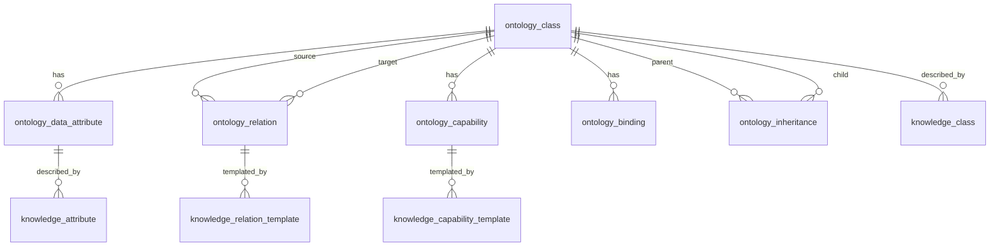

# M1 Database Design

## 1. Scope

M1 DB scope:
1. Ontology entities (class/attribute/relation/capability/binding/inheritance)
2. Knowledge entities (class/attribute/templates/few-shot)
3. Hybrid retrieval support fields (`search_tsv`, `embedding`)

## 2. Table Definitions (DDL View)

### 2.1 ontology_class

| Field | Data Type | Constraint | Default | Comment |
|---|---|---|---|---|
| id | BIGSERIAL | PK | - | Class ID |
| tenant_id | VARCHAR(64) | NN | - | Tenant key |
| code | VARCHAR(128) | NN, Unique(tenant_id, code) | - | Class code |
| name | VARCHAR(256) | NN | - | Class name |
| description | TEXT | - | NULL | Description |
| status | SMALLINT | NN | 1 | Logical status |
| version | INTEGER | NN | 1 | Version |
| created_at | TIMESTAMP | NN | now() | Created time |
| updated_at | TIMESTAMP | NN | now() | Updated time |

### 2.2 ontology_inheritance

| Field | Data Type | Constraint | Default | Comment |
|---|---|---|---|---|
| id | BIGSERIAL | PK | - | Record ID |
| tenant_id | VARCHAR(64) | NN | - | Tenant key |
| parent_class_id | BIGINT | FK -> ontology_class.id, NN | - | Parent class |
| child_class_id | BIGINT | FK -> ontology_class.id, NN | - | Child class |
| created_at | TIMESTAMP | NN | now() | Created time |

Extra rules:
1. Unique(tenant_id, parent_class_id, child_class_id)
2. `parent_class_id != child_class_id`
3. No cycle (service-layer DFS validation)

### 2.3 ontology_data_attribute

| Field | Data Type | Constraint | Default | Comment |
|---|---|---|---|---|
| id | BIGSERIAL | PK | - | Attribute ID |
| tenant_id | VARCHAR(64) | NN | - | Tenant key |
| class_id | BIGINT | FK -> ontology_class.id, NN | - | Owner class |
| code | VARCHAR(128) | NN | - | Attribute code |
| name | VARCHAR(256) | NN | - | Attribute name |
| data_type | VARCHAR(32) | NN | - | string/int/date/boolean/json |
| required | BOOLEAN | NN | false | Required flag |
| description | TEXT | - | NULL | Description |
| constraints_json | JSONB | - | '{}'::jsonb | Constraints |
| search_text | TEXT | - | NULL | Sparse retrieval text |
| search_tsv | TSVECTOR | - | NULL | Sparse retrieval index field |
| embedding | VECTOR(1024) | - | NULL | Dense vector |
| created_at | TIMESTAMP | NN | now() | Created time |
| updated_at | TIMESTAMP | NN | now() | Updated time |

### 2.4 ontology_relation

| Field | Data Type | Constraint | Default | Comment |
|---|---|---|---|---|
| id | BIGSERIAL | PK | - | Relation ID |
| tenant_id | VARCHAR(64) | NN | - | Tenant key |
| source_class_id | BIGINT | FK -> ontology_class.id, NN | - | Source class |
| target_class_id | BIGINT | FK -> ontology_class.id, NN | - | Target class |
| code | VARCHAR(128) | NN | - | Relation code |
| name | VARCHAR(256) | NN | - | Relation name |
| relation_type | VARCHAR(32) | NN | - | transform/query |
| mcp_bindings_json | JSONB | - | '[]'::jsonb | MCP bindings |
| created_at | TIMESTAMP | NN | now() | Created time |
| updated_at | TIMESTAMP | NN | now() | Updated time |

### 2.5 ontology_capability

| Field | Data Type | Constraint | Default | Comment |
|---|---|---|---|---|
| id | BIGSERIAL | PK | - | Capability ID |
| tenant_id | VARCHAR(64) | NN | - | Tenant key |
| class_id | BIGINT | FK -> ontology_class.id, NN | - | Owner class |
| code | VARCHAR(128) | NN | - | Capability code |
| name | VARCHAR(256) | NN | - | Capability name |
| input_schema | JSONB | NN | - | Input JSON Schema |
| output_schema | JSONB | NN | - | Output JSON Schema |
| mcp_bindings_json | JSONB | - | '[]'::jsonb | MCP bindings |
| created_at | TIMESTAMP | NN | now() | Created time |
| updated_at | TIMESTAMP | NN | now() | Updated time |

### 2.6 ontology_binding

| Field | Data Type | Constraint | Default | Comment |
|---|---|---|---|---|
| id | BIGSERIAL | PK | - | Binding ID |
| tenant_id | VARCHAR(64) | NN | - | Tenant key |
| class_id | BIGINT | FK -> ontology_class.id, NN | - | Bound class |
| binding_type | VARCHAR(16) | NN | - | table/api |
| binding_config | JSONB | NN | - | Binding config |
| created_at | TIMESTAMP | NN | now() | Created time |
| updated_at | TIMESTAMP | NN | now() | Updated time |

### 2.7 knowledge_class

| Field | Data Type | Constraint | Default | Comment |
|---|---|---|---|---|
| id | BIGSERIAL | PK | - | Record ID |
| tenant_id | VARCHAR(64) | NN | - | Tenant key |
| class_id | BIGINT | FK -> ontology_class.id, NN | - | Class ID |
| overview | TEXT | NN | - | Class overview |
| constraints_desc | TEXT | - | NULL | Constraint description |
| relation_desc | TEXT | - | NULL | Relation description |
| capability_desc | TEXT | - | NULL | Capability description |
| version | INTEGER | NN | 1 | Version |
| created_at | TIMESTAMP | NN | now() | Created time |

### 2.8 knowledge_attribute

| Field | Data Type | Constraint | Default | Comment |
|---|---|---|---|---|
| id | BIGSERIAL | PK | - | Record ID |
| tenant_id | VARCHAR(64) | NN | - | Tenant key |
| attribute_id | BIGINT | FK -> ontology_data_attribute.id, NN | - | Attribute ID |
| definition | TEXT | NN | - | Definition |
| synonyms_json | JSONB | - | '[]'::jsonb | Synonyms |
| constraints_desc | TEXT | - | NULL | Constraint description |
| version | INTEGER | NN | 1 | Version |

### 2.9 knowledge_relation_template

| Field | Data Type | Constraint | Default | Comment |
|---|---|---|---|---|
| id | BIGSERIAL | PK | - | Template ID |
| tenant_id | VARCHAR(64) | NN | - | Tenant key |
| relation_id | BIGINT | FK -> ontology_relation.id, NN | - | Relation ID |
| prompt_template | TEXT | NN | - | Prompt template |
| template_schema | JSONB | NN | - | Template schema |
| mcp_slots_json | JSONB | - | '[]'::jsonb | MCP slots |
| version | INTEGER | NN | 1 | Version |

### 2.10 knowledge_capability_template

| Field | Data Type | Constraint | Default | Comment |
|---|---|---|---|---|
| id | BIGSERIAL | PK | - | Template ID |
| tenant_id | VARCHAR(64) | NN | - | Tenant key |
| capability_id | BIGINT | FK -> ontology_capability.id, NN | - | Capability ID |
| prompt_template | TEXT | NN | - | Prompt template |
| template_schema | JSONB | NN | - | Template schema |
| mcp_slots_json | JSONB | - | '[]'::jsonb | MCP slots |
| version | INTEGER | NN | 1 | Version |

### 2.11 knowledge_fewshot_example

| Field | Data Type | Constraint | Default | Comment |
|---|---|---|---|---|
| id | BIGSERIAL | PK | - | Few-shot ID |
| tenant_id | VARCHAR(64) | NN | - | Tenant key |
| scope_type | VARCHAR(16) | NN | - | class/attr/relation/capability |
| scope_id | BIGINT | NN | - | Polymorphic scope ID |
| input_text | TEXT | NN | - | Input sample |
| output_text | TEXT | NN | - | Output sample |
| tags_json | JSONB | - | '[]'::jsonb | Tags |
| embedding | VECTOR(1024) | - | NULL | Dense vector |
| created_at | TIMESTAMP | NN | now() | Created time |

## 3. Entity Relationship Diagram

Note: `knowledge_fewshot_example(scope_type, scope_id)` uses business-level polymorphic mapping, not strict FK.

## 4. CRUD Permission Matrix

| Module | ontology_class | ontology_inheritance | ontology_data_attribute | ontology_relation | ontology_capability | ontology_binding | knowledge_class | knowledge_attribute | knowledge_relation_template | knowledge_capability_template | knowledge_fewshot_example |
|---|---|---|---|---|---|---|---|---|---|---|---|
| OntologyModule | C/R/U/D | C/R/U/D | C/R/U/D | C/R/U/D | C/R/U/D | C/R/U/D | R | R | R | R | R |
| KnowledgeModule | R | R | R | R | R | R | C/R/U | C/R/U | C/R/U | C/R/U | C/R/U/D |
| MCPMetadataModule | R | R | R | R | R | R | R | R | R | R | R |
| RetrievalEngine | R | - | R/U | - | - | - | - | R | - | - | R/U |
| TenantAuthModule | R | R | R | R | R | R | R | R | R | R | R |

Legend:
1. `C` = Create
2. `R` = Read
3. `U` = Update
4. `D` = Logical Delete

## 5. 需求 1.3/1.6 对齐补充（优先级覆盖前文冲突）

说明：如与前文冲突，以本节为准。

1. 元模型重构（OWL 对齐）
- `ontology_data_attribute` 改为全局目录表，不再以 `class_id` 作为归属字段。
- 新增 `ontology_class_data_attr_ref`（class_id, data_attr_id）维护“本体引用数据属性”。
- `ontology_relation` 作为全局对象属性目录，新增：
  - `ontology_relation_domain_ref`（relation_id, class_id）
  - `ontology_relation_range_ref`（relation_id, class_id）
  支持 domain/range 多本体。
- `ontology_capability` 作为全局能力目录，新增 `ontology_class_capability_ref`（class_id, capability_id, enabled）。

2. 本体关联表（One-Class-One-Table）
- 新增/强化 `ontology_class_table_binding`：
  - Unique(tenant_id, class_id) 确保每个本体仅一张关联表。
- 新增 `ontology_class_field_mapping`：
  - (binding_id, data_attr_id, field_name) 映射数据属性与物理字段。

3. 知识框架结构化字段（对齐 1.3）
- 对象属性知识表、能力知识表均需增加以下字段：
  - `intent_desc` TEXT
  - `few_shot_examples` JSONB
  - `json_schema` JSONB
  - `skill_md` TEXT
  - `prompt_template` TEXT
  - `mcp_bindings_json` JSONB
- 以上字段作为 2.1 执行细节查询和 2.2 任务递归执行的最小完备信息。

4. OWL 导出与一致性校验
- 新增 `ontology_export_task`（可选）记录导出任务、版本、校验状态和导出产物 URI。
- 新增 `ontology_semantic_validation_log`（可选）记录 OWL 约束校验错误（domain/range、继承环、未绑定属性等）。
