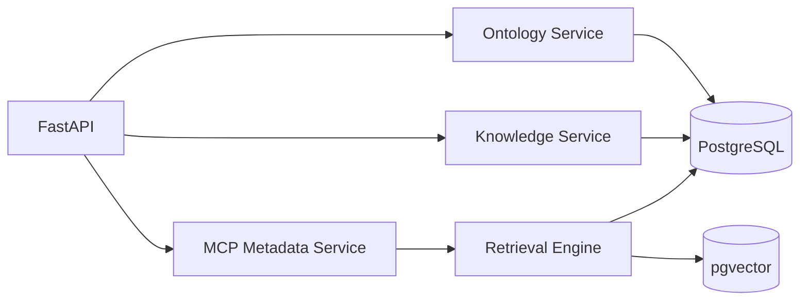
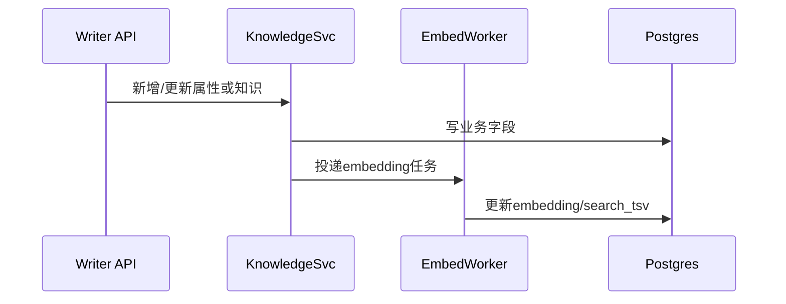

# Project_TheWorld M1 详细设计文档

## 1. 文档目标

本文档用于指导 M1 阶段研发落地，覆盖：

1. 本体管理（Ontology CRUD、继承、绑定）
2. 知识框架（本体/属性/关系/能力知识管理）
3. 系统级元数据 MCP 接口
4. Hybrid Search（关键词+向量）检索能力

文档面向后端、算法、测试、运维，可直接作为开发与联调依据。

## 2. M1 范围定义

### 2.1 In Scope

1. 本体、属性、关系、能力的完整 CRUD 与版本管理。
2. 本体继承关系维护（父子本体）。
3. 本体绑定信息维护（物理表绑定、接口绑定元数据）。
4. 知识管理（概述、约束、提示词模板、Few-shot 样本）。
5. 元数据查询 MCP（4 个核心接口）：
- 数据属性匹配查询
- 数据属性查询本体
- 本体详情查询
- 关系/能力详情查询
6. Hybrid Search 检索管道（BM25 + Dense）。
7. 本体与知识录入管理页面（`/theworld/v1/console`）与配套查询接口（Class 列表、Knowledge 最新版本查询）。

### 2.2 Out of Scope（M2+）

1. 主子会话编排与并行执行。
2. Error Recovery Node 和复杂任务递归。
3. Data Virtualization（Text-to-SQL/Text-to-Request 执行）。
4. 链路可视化前端画布。

## 3. 技术基线

1. `Python 3.13.1`
2. `FastAPI`
3. `SQLAlchemy 2.x + Alembic`
4. `PostgreSQL 14.21 + pgvector`
5. `Redis 7`
6. Embedding 模型：`bge-m3`（可替换）
7. 分词检索：Postgres `tsvector`（中文建议接入 `zhparser` 或 ES）
8. 鉴权：JWT + RBAC（M1 先实现基础租户隔离）
9. 可观测：OpenTelemetry + 结构化日志（JSON）

## 4. 系统设计

## 4.1 逻辑架构（M1）



## 4.2 服务职责

1. `Ontology Service`
- 本体/属性/关系/能力 CRUD
- 继承关系校验（禁止环）
- 绑定信息管理（table/api）

2. `Knowledge Service`
- Class/Attribute/Relation/Capability 知识录入
- Prompt 模板版本化
- Few-shot 样本录入与向量化入库

3. `MCP Metadata Service`
- 暴露统一 MCP 风格元数据检索 API
- 统一参数校验、排序、分页、返回结构

4. `Retrieval Engine`
- 关键词召回（BM25/ts_rank）
- 向量召回（cosine similarity）
- 融合打分与排序

## 5. 数据模型设计

## 5.1 核心表（PostgreSQL）

### 5.1.1 ontology_class

1. `id` BIGSERIAL PK
2. `tenant_id` VARCHAR(64) NOT NULL
3. `code` VARCHAR(128) UNIQUE(tenant_id, code)
4. `name` VARCHAR(256) NOT NULL
5. `description` TEXT
6. `status` SMALLINT DEFAULT 1
7. `version` INTEGER DEFAULT 1
8. `created_at` TIMESTAMP
9. `updated_at` TIMESTAMP

索引：
1. `idx_ontology_class_tenant_status(tenant_id,status)`
2. `uk_ontology_class_tenant_code(tenant_id,code)`

### 5.1.2 ontology_inheritance

1. `id` BIGSERIAL PK
2. `tenant_id` VARCHAR(64)
3. `parent_class_id` BIGINT
4. `child_class_id` BIGINT
5. `created_at` TIMESTAMP

约束：
1. `uk_inherit(tenant_id,parent_class_id,child_class_id)`
2. 禁止 `parent=child`
3. 业务层 DFS 校验无环

### 5.1.3 ontology_data_attribute

1. `id` BIGSERIAL PK
2. `tenant_id` VARCHAR(64)
3. `class_id` BIGINT FK ontology_class
4. `code` VARCHAR(128)
5. `name` VARCHAR(256)
6. `data_type` VARCHAR(32)（string/int/date/boolean/json）
7. `required` BOOLEAN DEFAULT FALSE
8. `description` TEXT
9. `constraints_json` JSONB
10. `search_text` TEXT
11. `search_tsv` TSVECTOR
12. `embedding` VECTOR(1024)
13. `created_at` TIMESTAMP
14. `updated_at` TIMESTAMP

索引：
1. `idx_attr_tenant_class(tenant_id,class_id)`
2. `gin_idx_attr_tsv(search_tsv)`
3. `ivfflat_idx_attr_embedding(embedding vector_cosine_ops)`

### 5.1.4 ontology_relation

1. `id` BIGSERIAL PK
2. `tenant_id` VARCHAR(64)
3. `source_class_id` BIGINT
4. `target_class_id` BIGINT
5. `code` VARCHAR(128)
6. `name` VARCHAR(256)
7. `relation_type` VARCHAR(32)（transform/query）
8. `mcp_bindings_json` JSONB
9. `created_at` TIMESTAMP
10. `updated_at` TIMESTAMP

### 5.1.5 ontology_capability

1. `id` BIGSERIAL PK
2. `tenant_id` VARCHAR(64)
3. `class_id` BIGINT
4. `code` VARCHAR(128)
5. `name` VARCHAR(256)
6. `input_schema` JSONB
7. `output_schema` JSONB
8. `mcp_bindings_json` JSONB
9. `created_at` TIMESTAMP
10. `updated_at` TIMESTAMP

### 5.1.6 ontology_binding

1. `id` BIGSERIAL PK
2. `tenant_id` VARCHAR(64)
3. `class_id` BIGINT
4. `binding_type` VARCHAR(16)（table/api）
5. `binding_config` JSONB
6. `created_at` TIMESTAMP
7. `updated_at` TIMESTAMP

`binding_config` 示例：
1. table: `{ "db":"ods","schema":"public","table":"customer" }`
2. api: `{ "endpoint":"/v1/customer/query","method":"POST","timeout_ms":2000 }`

### 5.1.7 knowledge_class

1. `id` BIGSERIAL PK
2. `tenant_id` VARCHAR(64)
3. `class_id` BIGINT
4. `overview` TEXT
5. `constraints_desc` TEXT
6. `relation_desc` TEXT
7. `capability_desc` TEXT
8. `version` INTEGER
9. `created_at` TIMESTAMP

### 5.1.8 knowledge_attribute

1. `id` BIGSERIAL PK
2. `tenant_id` VARCHAR(64)
3. `attribute_id` BIGINT
4. `definition` TEXT
5. `synonyms_json` JSONB
6. `constraints_desc` TEXT
7. `version` INTEGER

### 5.1.9 knowledge_relation_template

1. `id` BIGSERIAL PK
2. `tenant_id` VARCHAR(64)
3. `relation_id` BIGINT
4. `prompt_template` TEXT
5. `template_schema` JSONB
6. `mcp_slots_json` JSONB
7. `version` INTEGER

### 5.1.10 knowledge_capability_template

1. `id` BIGSERIAL PK
2. `tenant_id` VARCHAR(64)
3. `capability_id` BIGINT
4. `prompt_template` TEXT
5. `template_schema` JSONB
6. `mcp_slots_json` JSONB
7. `version` INTEGER

### 5.1.11 knowledge_fewshot_example

1. `id` BIGSERIAL PK
2. `tenant_id` VARCHAR(64)
3. `scope_type` VARCHAR(16)（class/attr/relation/capability）
4. `scope_id` BIGINT
5. `input_text` TEXT
6. `output_text` TEXT
7. `tags_json` JSONB
8. `embedding` VECTOR(1024)
9. `created_at` TIMESTAMP

索引：
1. `idx_fewshot_scope(tenant_id,scope_type,scope_id)`
2. `ivfflat_idx_fewshot_embedding(embedding vector_cosine_ops)`

## 5.2 版本策略

1. 内容更新采用“写新版本 + 标记 active_version”。
2. 查询默认读取最新激活版本。
3. 回滚：将旧版本置为 active，不做物理删除。

## 6. API 设计

统一约定：
1. 基础路径：`/api/v1`
2. Header：`X-Tenant-Id`、`Authorization`
3. 返回结构：

```json
{
  "code": 0,
  "message": "ok",
  "data": {},
  "trace_id": "..."
}
```

## 6.1 Ontology 管理 API

1. `POST /ontology/classes`
2. `GET /ontology/classes`（列表）
3. `GET /ontology/classes/{id}`
4. `PUT /ontology/classes/{id}`
5. `DELETE /ontology/classes/{id}`（逻辑删除）
6. `POST /ontology/classes/{id}/inheritance`
7. `POST /ontology/classes/{id}/attributes`
8. `POST /ontology/classes/{id}/relations`
9. `POST /ontology/classes/{id}/capabilities`
10. `POST /ontology/classes/{id}/bindings`

关键校验：
1. `code` 租户内唯一
2. 继承链无环
3. capability 的 `input_schema/output_schema` 必须是合法 JSON Schema

## 6.2 Knowledge 管理 API

1. `POST /knowledge/classes/{class_id}`
2. `GET /knowledge/classes/{class_id}/latest`
3. `POST /knowledge/attributes/{attribute_id}`
4. `GET /knowledge/attributes/{attribute_id}/latest`
5. `POST /knowledge/relations/{relation_id}/templates`
6. `GET /knowledge/relations/{relation_id}/templates/latest`
7. `POST /knowledge/capabilities/{capability_id}/templates`
8. `GET /knowledge/capabilities/{capability_id}/templates/latest`
9. `POST /knowledge/fewshot/examples`
10. `GET /knowledge/fewshot/examples`
11. `GET /knowledge/fewshot/examples/search`

Few-shot 检索参数：
1. `scope_type`
2. `scope_id`
3. `query`
4. `top_k`（默认 5）

## 6.3 系统级 MCP 元数据 API（M1 核心）

### 6.3.1 数据属性匹配查询

`POST /mcp/metadata/attributes:match`

请求：

```json
{
  "query": "按身份证号查客户信息",
  "filters": {
    "domain": "customer"
  },
  "top_k": 20,
  "page": 1,
  "page_size": 20
}
```

返回项：
1. `attribute_id`
2. `name`
3. `score`
4. `class_refs`
5. `knowledge_summary`

### 6.3.2 数据属性查询本体

`POST /mcp/metadata/ontologies:by-attributes`

请求：

```json
{
  "attribute_ids": [1001, 1002],
  "top_k": 20
}
```

返回：
1. `class_id`
2. `name`
3. `match_strength`（0-1）
4. `matched_attributes`
5. `knowledge_summary`

### 6.3.3 本体详情查询

`GET /mcp/metadata/ontologies/{class_id}`

返回：
1. class 基本信息
2. 属性列表及知识摘要
3. 关系列表
4. 能力列表
5. 绑定信息

### 6.3.4 关系/能力详情查询

`GET /mcp/metadata/execution/{type}/{id}`，`type in [relation, capability]`

返回：
1. 执行描述
2. prompt template
3. MCP 绑定定义
4. 输入输出 schema

## 6.4 页面入口（M1 管理台）

1. `GET /theworld/v1/console`
2. 页面功能：本体及其属性/关系/能力/绑定录入、知识录入、列表与详情查看。

## 7. Hybrid Search 详细设计

## 7.1 索引构建流程



## 7.2 检索流程

1. Query 预处理：标准化、同义词扩展、停用词处理。
2. Sparse 召回：`ts_rank(search_tsv, plainto_tsquery(q))`。
3. Dense 召回：query embedding + cosine 相似度。
4. 融合打分（RRF）：
- `score = w1 * sparse_norm + w2 * dense_norm`
- 默认 `w1=0.45, w2=0.55`
5. 业务重排：
- 命中 required 属性加权
- 领域过滤匹配加权
6. 输出 Top-K + 分页。

## 7.3 SQL 示例（向量检索）

```sql
SELECT id, name, 1 - (embedding <=> :query_vec) AS dense_score
FROM ontology_data_attribute
WHERE tenant_id = :tenant_id
ORDER BY embedding <=> :query_vec
LIMIT :k;
```

## 8. 关键业务规则

1. 继承规则：
- 子本体查询详情时合并父本体属性/关系/能力（可标识 inherited=true）。

2. 删除规则：
- 存在被引用关系时禁止硬删除；M1 全部逻辑删除。

3. 知识生效规则：
- 仅 `published` 版本可被 MCP 检索接口返回。

4. 租户隔离：
- 所有读写 SQL 强制带 `tenant_id` 条件。

## 9. 错误码规范

1. `0` 成功
2. `1001` 参数校验失败
3. `1002` 资源不存在
4. `1003` 资源冲突（重复 code）
5. `1004` 继承环检测失败
6. `1005` Schema 非法
7. `2001` 检索服务不可用
8. `2002` 向量化超时
9. `9000` 系统内部错误

## 10. 代码结构建议

```text
app/
  api/
    ontology.py
    knowledge.py
    mcp_metadata.py
  domain/
    ontology/
    knowledge/
    retrieval/
  infra/
    db/
    cache/
    embedding/
  schemas/
  services/
  repositories/
  workers/
alembic/
tests/
```

## 11. 开发任务拆解（M1）

1. 任务 A：数据库建模与迁移（Alembic）
2. 任务 B：Ontology CRUD + 继承校验
3. 任务 C：Knowledge CRUD + 版本管理
4. 任务 D：Embedding Worker 与索引更新任务
5. 任务 E：Hybrid Search 引擎实现
6. 任务 F：4 个 MCP 元数据接口实现
7. 任务 G：鉴权、租户隔离、中间件
8. 任务 H：本体与知识录入管理页面实现（`/theworld/v1/console`）
9. 任务 I：测试与性能压测

## 12. 测试设计

## 12.1 单元测试

1. 继承环校验
2. schema 校验
3. 打分融合逻辑
4. 版本切换逻辑

## 12.2 集成测试

1. 新增属性 -> 向量化 -> 可检索闭环
2. 多属性查本体排序正确性
3. 本体详情合并继承内容
4. 管理页面可访问，Class 列表与 Knowledge 最新版本接口可用

## 12.3 性能基线（M1 验收）

1. 属性匹配查询 P95 < 800ms（10 万属性）
2. 本体详情查询 P95 < 300ms
3. 索引更新延迟 < 5s（异步）

## 13. 部署与配置

1. 服务：`api`、`worker` 分离部署。
2. 必要环境变量：
- `DB_DSN`
- `REDIS_DSN`
- `EMBEDDING_MODEL`
- `JWT_PUBLIC_KEY`
- `DEFAULT_TOP_K`
3. 初始化脚本：
- Alembic migration
- pgvector extension 创建
- 索引构建任务启动

## 14. 验收清单（M1 Done Definition）

1. 4 类核心实体 CRUD 功能全部可用（本体/属性/关系/能力）。
2. 知识录入与版本切换可用。
3. 4 个元数据 MCP 接口通过联调。
4. Hybrid Search 返回结果可解释（含评分字段）。
5. 租户隔离与基础 RBAC 生效。
6. 全量接口具备 trace_id 与错误码。
7. 管理页面支持本体与知识录入管理闭环。

## 15. 需求 1.3/1.6 对齐补充（优先级覆盖前文冲突）

说明：如与前文冲突，以本节为准。

### 15.1 知识框架重构（对齐 1.3）

1. 本体 Class 知识
- `overview`
- `constraints`
- `object_property_skill_desc`
- `capability_skill_desc`

2. 数据属性知识
- `definition`
- `constraints`
- `synonyms`

3. 对象属性知识（必须结构化）
- `intent_desc`
- `few_shot_examples`
- `json_schema`
- `skill_md`
- `prompt_template`
- `mcp_bindings`

4. 本体能力知识（必须结构化）
- `intent_desc`
- `few_shot_examples`
- `json_schema`
- `skill_md`
- `prompt_template`
- `mcp_bindings`

### 15.2 OWL 对齐设计（对齐 1.6）

1. 本体：`owl:Class`，父子关系树状管理。
2. 数据属性：`owl:DatatypeProperty`，全局定义，在本体中引用。
3. 对象属性：`owl:ObjectProperty`，`domain/range` 均支持多本体。
4. 本体能力：扩展标签承载 Action 元数据，可独立存在或挂载本体。
5. 本体关联表：一本体一张表，属性字段映射作为显式配置。
6. 导出：支持 OWL 文件导出，保证可被 RDF4J 等工具消费。

### 15.3 对 2.1/2.2 的适配评估

1. 2.1（系统 MCP）评估
- 需求关键：属性匹配、本体定位、本体详情、关系/能力执行细节应可供 LLM 二次筛选与执行。
- 结论：若无 15.1 的结构化知识字段与 15.2 的全局目录化模型，执行细节不足以支撑稳定工具调用；补充后可满足。

2. 2.2（推理引导框架）评估
- 需求关键：从用户输入逐步收敛到任务，并在关系/能力层面递归执行与并行。
- 结论：任务执行依赖“可机读的技能描述 + Schema + MCP 插槽”；补充后可形成从筛选到执行的闭环，满足递归和澄清场景。

3. 评估结论（总）
- 当前文档经本节补充后，知识框架设计可支持 2.1/2.2 的推理过程与能力要求。
- 后续实现验收应以“结构化知识完备性 + 递归任务可执行性”作为核心检查项。
