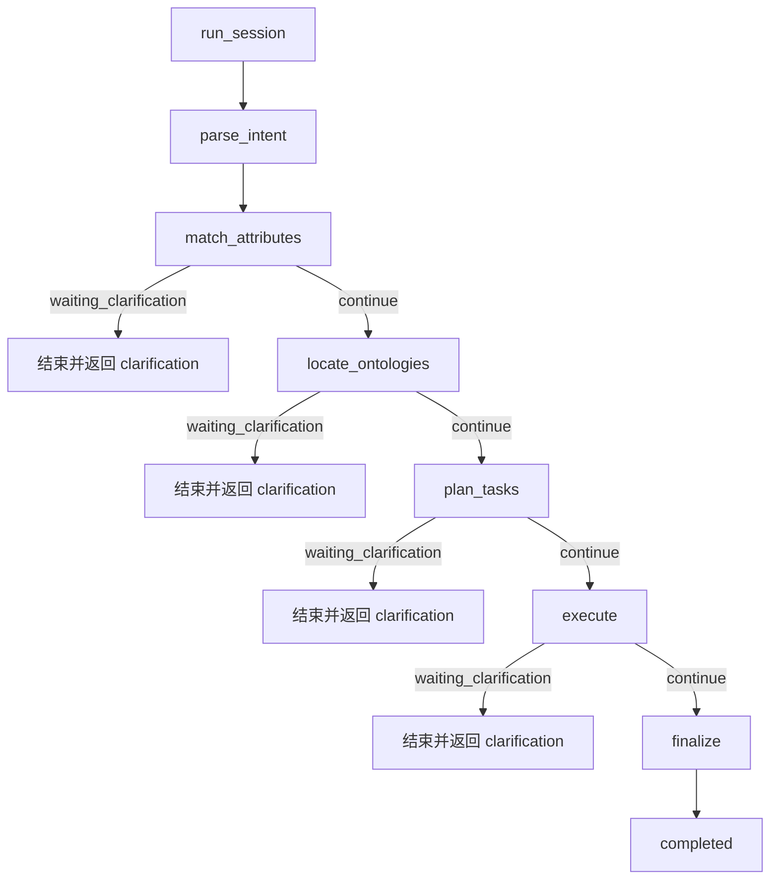

# Graph Chat 后台处理流程与 LLM 交互说明（对齐当前实现）

## 1. 入口与调用链

Graph Workspace 右侧聊天框发送消息后，后端调用链为：

1. 前端 `src/app/ui/graph_workspace.html`：
   - 首次消息：`POST /api/v1/reasoning/sessions` 创建会话。
   - 然后调用：`POST /api/v1/reasoning/sessions/{session_id}/run`。
   - 若处于澄清态：先 `POST /clarify`，再 `POST /run`。
2. API 层 `src/app/api/v1/reasoning.py`。
3. 服务层 `src/app/services/reasoning_service.py`（LangGraph 状态机）。
4. LLM 封装 `src/app/services/llm/langchain_client.py`（仅在 finalize 阶段调用）。

说明：前端会把 `graph_context` 放在 `create_session.metadata`（`source=graph_workspace`）中；当前推理节点未直接消费该上下文，仅持久化到 context。

## 2. LangGraph 节点与分支（当前代码）

状态机节点顺序：

`parse_intent -> match_attributes -> locate_ontologies -> plan_tasks -> execute -> finalize`

每个关键节点均通过 `TraceService.emit` 记录审计事件（包括 `mcp_call_requested/completed`、`llm_prompt_sent/llm_response_received`）。

## 3. 各节点实际行为

### 3.1 parse_intent

- 不调用 LLM。
- 记录 `intent_parsed` 事件。
- 当前不做语义分类，仅透传状态。

### 3.2 match_attributes

- 不调用 LLM。
- 调用 `MCPMetadataService.match_attributes`。
- 参数固定：`top_k=10, page=1, page_size=10`。
- 无结果则进入 `waiting_clarification`，问题类型：`no_attribute_match`。

### 3.3 locate_ontologies

- 不调用 LLM。
- 取前 5 个属性 id，调用 `ontologies_by_attributes(top_k=5)`。
- 无结果则进入 `waiting_clarification`，问题类型：`no_ontology_match`。
- 有结果则 `top_ontology = items[0]`。

### 3.4 plan_tasks

- 不调用 LLM。
- 调用 `ontology_detail(class_id)` 取能力列表。
- 无能力则 `waiting_clarification`，问题类型：`no_capability_match`。
- 有能力时会为前 5 个能力逐个创建 `reasoning_task`（`task_type=capability`）。

### 3.5 execute

- 不调用 LLM（当前版本）。
- 默认选第一个任务执行，并将该任务状态置为 `completed`。
- 执行模式按 query 关键词分流：
  - 命中 `分组/统计/group/count/sum/avg/平均` -> `mcp.data.group_analysis`，返回 `data_mode=group-analysis`。
  - 否则 -> `mcp.data.query`，返回 `data_mode=query`。
- 若无任务则进入 `waiting_clarification`，问题类型：`task_planning_empty`。

### 3.6 finalize

- 调用 LLM 生成摘要：`LangChainLLMClient.summarize_with_context(...)`。
- 成功时写入 `model_output.summary`。
- 若 LLM 调用异常，会回退到固定摘要文本（不会中断整条链路）。
- 输出附带：
  - `orchestration_framework=langgraph`
  - `llm_framework=langchain`
  - `llm_route`（provider/model/has_fallback）
  - `data_execution_mode` 与 `data_execution`

## 4. run_session 的外层控制流

`ReasoningService.run_session` 还包含以下关键逻辑：

1. 若存在 pending clarification，会直接返回 `waiting_clarification`，不进入状态机。
2. 若传入 `user_input`，会新建 turn；否则复用最新 turn。
3. 状态机返回 `waiting_clarification` 时，会创建 `reasoning_clarification` 记录并返回问题。
4. 完成态会写入：
   - `reasoning_turn.model_output`
   - `reasoning_context` 的 `selected_ontology` 与 `latest_result`
   - trace 事件 `session_completed`
5. 异常分支会将 session/turn 标记为 `failed` 并记录 `session_failed`。

## 5. 与前端 Graph Chat 的配合

`src/app/ui/graph_workspace.html` 当前配合方式：

1. 首次发言：create session（含 metadata.graph_context）后立即 run。
2. 普通追问：直接 `run(user_input)`。
3. 澄清回复：先 `clarify(answer)`，再 `run()`。
4. 聊天框展示：`result.summary`，并附加 `data_execution_mode`。
5. 审计弹窗读取：`GET /api/v1/reasoning/sessions/{session_id}/trace`。

## 6. 准确性结论

本文件已按当前工程实现对齐（`README.md` 中 M2/LangGraph/LangChain 描述与代码一致）。后续若调整节点参数或任务选择策略，应同步更新本文件与 `tests/integration/test_reasoning_session_flow.py`。
