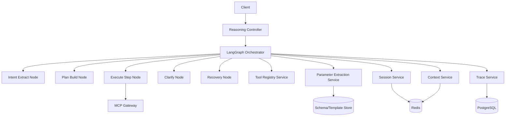

# M2 Architecture Spec

## 1. Scope

M2 only covers:
1. LangGraph 主链路编排
2. 歧义澄清节点
3. 错误恢复节点
4. 上下文作用域隔离（Global/Session/Local/Artifacts）
5. 非标准 Skill/MCP 的参数提取与映射（Parameter Extraction Agent）

## 2. Standard Tree

```text
Project_TheWorld/
├── src/
│   └── app/
│       ├── api/v1/
│       │   └── reasoning.py
│       ├── graph/
│       │   ├── state.py
│       │   ├── workflow.py
│       │   ├── nodes/
│       │   │   ├── input_normalize.py
│       │   │   ├── intent_extract.py
│       │   │   ├── ontology_locate.py
│       │   │   ├── tool_select.py
│       │   │   ├── plan_build.py
│       │   │   ├── execute_step.py
│       │   │   ├── clarify.py
│       │   │   ├── recovery.py
│       │   │   └── finalize.py
│       │   └── routers/transition_router.py
│       ├── services/
│       │   ├── reasoning_service.py
│       │   ├── context_service.py
│       │   ├── session_service.py
│       │   ├── tool_registry_service.py
│       │   └── parameter_extraction_service.py
│       ├── repositories/
│       │   ├── reasoning_repo.py
│       │   ├── context_repo.py
│       │   └── trace_repo.py
│       ├── schemas/
│       │   ├── reasoning.py
│       │   └── context.py
│       └── middleware/
│           └── trace_middleware.py
├── tests/
│   ├── unit/
│   │   ├── test_transition_router.py
│   │   ├── test_clarify_node.py
│   │   └── test_recovery_node.py
│   └── integration/
│       ├── test_reasoning_main_flow.py
│       └── test_context_scope_isolation.py
└── requirements.txt
```

## 3. requirements.txt Dependency List

| Library | Version | Core Purpose |
|---|---:|---|
| langgraph | >=0.2,<1.0 | 状态图编排 |
| langchain | >=0.2,<1.0 | LLM/tool 调用抽象 |
| fastapi | >=0.111,<1.0 | 推理 API |
| pydantic | >=2.7,<3.0 | 状态与参数校验 |
| redis | >=5.0,<6.0 | Session/Context 缓存 |
| sqlalchemy | >=2.0,<3.0 | 会话与追踪持久化 |
| opentelemetry-api | >=1.25,<2.0 | Trace API |
| opentelemetry-sdk | >=1.25,<2.0 | Trace SDK |
| structlog | >=24.0,<25.0 | 结构化日志 |
| pytest | >=8.0,<9.0 | 测试框架 |

## 4. Logical Architecture



## 5. PEP 8 Rules

1. 模块文件使用 `snake_case.py`
2. 类名使用 `PascalCase`
3. 函数/变量使用 `snake_case`
4. 常量使用 `UPPER_SNAKE_CASE`
