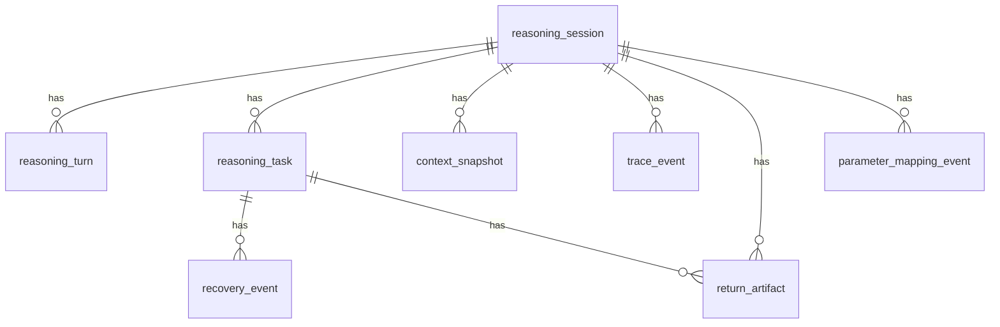

# M2 Database Design

## 1. Scope

M2 DB focuses on orchestration/session/context/trace persistence.

## 2. Table Definitions (DDL View)

### 2.1 reasoning_session

| Field | Data Type | Constraint | Default | Comment |
|---|---|---|---|---|
| id | BIGSERIAL | PK | - | 主键 |
| session_id | VARCHAR(64) | NN, Unique | - | 会话标识 |
| tenant_id | VARCHAR(64) | NN | - | 租户 |
| user_id | VARCHAR(64) | NN | - | 用户 |
| status | VARCHAR(32) | NN | 'CREATED' | 会话状态 |
| created_at | TIMESTAMP | NN | now() | 创建时间 |
| updated_at | TIMESTAMP | NN | now() | 更新时间 |

### 2.2 reasoning_turn

| Field | Data Type | Constraint | Default | Comment |
|---|---|---|---|---|
| id | BIGSERIAL | PK | - | 主键 |
| session_id | VARCHAR(64) | FK -> reasoning_session.session_id, NN | - | 会话 ID |
| turn_no | INTEGER | NN | - | 轮次 |
| user_input | TEXT | NN | - | 用户输入 |
| model_output | TEXT | - | NULL | 模型输出 |
| created_at | TIMESTAMP | NN | now() | 创建时间 |

### 2.3 reasoning_task

| Field | Data Type | Constraint | Default | Comment |
|---|---|---|---|---|
| id | BIGSERIAL | PK | - | 主键 |
| session_id | VARCHAR(64) | FK -> reasoning_session.session_id, NN | - | 会话 ID |
| task_code | VARCHAR(128) | NN | - | 任务编码 |
| status | VARCHAR(32) | NN | 'PENDING' | 任务状态 |
| retry_count | INTEGER | NN | 0 | 重试次数 |
| last_error | JSONB | - | NULL | 最近错误 |
| created_at | TIMESTAMP | NN | now() | 创建时间 |

### 2.4 context_snapshot

| Field | Data Type | Constraint | Default | Comment |
|---|---|---|---|---|
| id | BIGSERIAL | PK | - | 主键 |
| session_id | VARCHAR(64) | FK -> reasoning_session.session_id, NN | - | 会话 ID |
| scope | VARCHAR(16) | NN | - | global/session/local/artifact |
| content_json | JSONB | NN | - | 上下文内容 |
| created_at | TIMESTAMP | NN | now() | 创建时间 |

### 2.5 recovery_event

| Field | Data Type | Constraint | Default | Comment |
|---|---|---|---|---|
| id | BIGSERIAL | PK | - | 主键 |
| session_id | VARCHAR(64) | FK -> reasoning_session.session_id, NN | - | 会话 ID |
| task_id | BIGINT | FK -> reasoning_task.id, NN | - | 任务 ID |
| strategy | VARCHAR(16) | NN | - | retry/replan/fallback |
| error_code | VARCHAR(32) | - | NULL | 错误码 |
| payload_json | JSONB | - | NULL | 恢复载荷 |
| created_at | TIMESTAMP | NN | now() | 创建时间 |

### 2.6 trace_event

| Field | Data Type | Constraint | Default | Comment |
|---|---|---|---|---|
| id | BIGSERIAL | PK | - | 主键 |
| trace_id | VARCHAR(64) | NN | - | 链路 ID |
| session_id | VARCHAR(64) | FK -> reasoning_session.session_id, NN | - | 会话 ID |
| span_type | VARCHAR(32) | NN | - | llm/tool/mcp/context |
| event_json | JSONB | NN | - | 事件内容 |
| created_at | TIMESTAMP | NN | now() | 创建时间 |

### 2.7 return_artifact

| Field | Data Type | Constraint | Default | Comment |
|---|---|---|---|---|
| id | BIGSERIAL | PK | - | 主键 |
| session_id | VARCHAR(64) | FK -> reasoning_session.session_id, NN | - | 会话 ID |
| task_id | BIGINT | FK -> reasoning_task.id, NN | - | 任务 ID |
| artifact_type | VARCHAR(32) | NN | - | ontology/instance/analysis |
| artifact_json | JSONB | NN | - | 回传工件内容 |
| created_at | TIMESTAMP | NN | now() | 创建时间 |

### 2.8 parameter_mapping_event

| Field | Data Type | Constraint | Default | Comment |
|---|---|---|---|---|
| id | BIGSERIAL | PK | - | 主键 |
| session_id | VARCHAR(64) | FK -> reasoning_session.session_id, NN | - | 会话 ID |
| source_type | VARCHAR(16) | NN | - | skill/mcp/api |
| source_schema_json | JSONB | NN | - | 非标准输入定义 |
| mapped_params_json | JSONB | NN | - | 映射输出参数 |
| confidence | NUMERIC(6,4) | - | NULL | 置信度 |
| validation_passed | BOOLEAN | NN | false | 是否通过校验 |
| created_at | TIMESTAMP | NN | now() | 创建时间 |

## 3. Entity Relationship Diagram

## 4. CRUD Permission Matrix

| Module | reasoning_session | reasoning_turn | reasoning_task | context_snapshot | recovery_event | trace_event | return_artifact | parameter_mapping_event |
|---|---|---|---|---|---|---|---|---|
| ReasoningModule | C/R/U | C/R/U | C/R/U | C/R/U | C/R/U | R | C/R/U | C/R/U |
| ContextModule | R | - | - | C/R/U | - | R | R | R |
| RecoveryModule | R | - | R/U | R | C/R/U | R | R | R |
| TraceModule | R | R | R | R | R | C/R/U | R | R |
| APIQueryModule | R | R | R | R | R | R | R | R |
