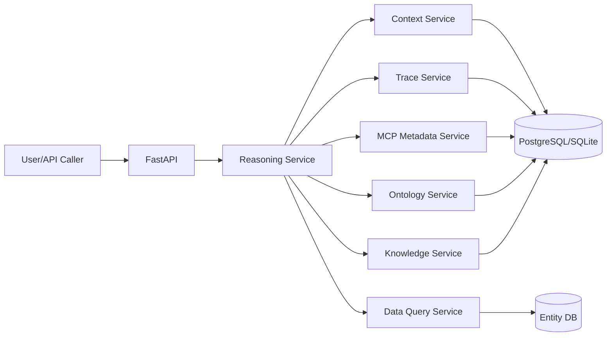

# Project_TheWorld M2 详细设计文档（基于当前 M1 实现）

## 1. 文档目标

在 M1 已完成“本体建模 + 知识管理 + 元数据 MCP + Console/Graph + Hybrid Search”的基础上，M2 目标是补齐“推理引导主链路”能力：

1. 从用户输入自动收敛到本体与能力。
2. 支持澄清、多候选选择、失败恢复。
3. 提供可追踪的推理执行记录。
4. 保持与当前单体 FastAPI 工程兼容，避免推倒重来。

---

## 2. 基线与约束

### 2.1 当前基线（来自 M1）

1. 已有本体域 CRUD、绑定、OWL、实体表映射、数据管理。
2. 已有知识模板与 fewshot 管理。
3. 已有 MCP Metadata 四类接口。
4. 已有 MCP Graph Tool 与图谱工作台。
5. 已有 Hybrid Search（score、top_n、gap、relative_diff、pg_trgm 可选）。
6. 已有 Alembic baseline（`20260218_0001`）。

### 2.2 M2 设计约束

1. 继续采用单体服务（`src/app`）优先，避免提前拆微服务。
2. M2 默认不引入复杂并行子会话调度（放 M3）。
3. 所有新增能力必须复用现有 ontology/knowledge/mcp 服务层，避免重复实现。

---

## 3. M2 范围定义

### 3.1 In Scope（本阶段实现目标）

1. 推理编排主链路（单会话、串行任务）。
2. 意图到本体能力的引导流程（2.2 核心链路）。
3. 澄清机制（无匹配/多匹配主动提问）。
4. 错误恢复机制（参数修正、重试、候选路径切换）。
5. 上下文作用域（global/session/local/artifacts）与持久化。
6. 推理链路追踪（会话、步骤、MCP 调用、错误事件）。
7. 系统级数据获取能力补齐（2.1 中“条件查询/分组分析”的统一入口，先覆盖物理表本体）。

### 3.2 Out of Scope（M3+）

1. 多子会话并行与递归编排（2.4 高阶能力）。
2. 通用 Data Virtualization（Text-to-SQL + Text-to-Request 全模式）。
3. 图形化链路画布与高级运维看板。
4. GraphRAG/Re-ranking/检索路由器。

---

## 4. 目标架构（M2）



设计说明：
1. `Reasoning Service` 作为 M2 新核心模块，编排已有服务能力。
2. `Context Service` 与 `Trace Service` 先落库存储（可后续接 Redis/OTel）。

---

## 5. 推理状态模型

### 5.1 会话状态

1. `created`
2. `understanding`
3. `locating`
4. `planning`
5. `executing`
6. `waiting_clarification`
7. `recovering`
8. `completed`
9. `failed`

### 5.2 AgentState（逻辑结构）

```python
class AgentState(TypedDict):
    session_id: str
    tenant_id: str
    user_input: str
    normalized_query: str
    selected_attributes: list[dict]
    candidate_ontologies: list[dict]
    candidate_tasks: list[dict]
    current_task: dict | None
    clarification: dict | None
    recovery: dict | None
    context_refs: dict
    final_answer: dict | None
```

---

## 6. M2 主链路设计

### 6.1 流程步骤

1. 输入规范化（query 清洗、租户校验）。
2. 属性匹配（调用 `attributes:match`）。
3. 本体定位（调用 `ontologies:by-attributes`）。
4. 本体详情拉取（调用 `ontologies/{class_id}`）。
5. 候选关系/能力筛选（结合知识模板）。
6. 生成执行计划（串行 task list）。
7. 执行单任务（元数据/数据查询）。
8. 成功收敛输出；失败进入恢复；多义进入澄清。

### 6.2 澄清触发条件

1. 无候选能力（空列表）。
2. Top1 与 Top2 分值差低于阈值（默认 0.08）。
3. 必填参数缺失且无法从上下文推导。

### 6.3 恢复策略

1. 参数类型修正（基于 schema）。
2. 缺参回填（从 session context 提取）。
3. 重试（最多 2 次，指数退避）。
4. 切换候选任务。
5. 最终失败则结构化返回错误原因与建议。

---

## 7. 模块设计（代码增量）

### 7.1 新增模块（建议）

1. `src/app/services/reasoning_service.py`
2. `src/app/services/context_service.py`
3. `src/app/services/trace_service.py`
4. `src/app/api/v1/reasoning.py`
5. `src/app/schemas/reasoning.py`
6. `src/app/repositories/reasoning_repo.py`

### 7.2 复用模块

1. `mcp_metadata_service.py`（属性匹配、本体定位、详情、执行细节）
2. `ontology_service.py`（实体表映射与数据管理能力）
3. `knowledge_service.py`（关系/能力模板）

---

## 8. API 设计（M2 新增）

前缀：`/api/v1/reasoning`

1. `POST /sessions`
   - 创建会话并写入首条输入。
2. `GET /sessions/{session_id}`
   - 获取会话状态、当前步骤、最近结果。
3. `POST /sessions/{session_id}/run`
   - 执行一次推理轮次（非流式）。
4. `POST /sessions/{session_id}/clarify`
   - 提交澄清答案并继续执行。
5. `GET /sessions/{session_id}/trace`
   - 返回步骤级链路。
6. `POST /sessions/{session_id}/cancel`
   - 取消会话（标记状态）。

补齐系统级数据获取入口（挂在现有 `mcp/metadata` 或新增 `mcp/data`，二选一）：
1. `POST /api/v1/mcp/data/query`
2. `POST /api/v1/mcp/data/group-analysis`

M2 约束：
1. 先支持“有物理表映射”的本体查询分析。
2. 接口绑定与无实体表模式在 M3 扩展。

---

## 9. 数据模型设计（M2 新增表）

1. `reasoning_session`
   - `id, tenant_id, status, created_at, updated_at, ended_at`
2. `reasoning_turn`
   - `id, session_id, turn_no, user_input, model_output, status`
3. `reasoning_task`
   - `id, session_id, turn_id, task_type, task_payload, status, retry_count`
4. `reasoning_context`
   - `id, session_id, scope, key, value_json, version`
5. `reasoning_trace_event`
   - `id, session_id, turn_id, step, event_type, payload_json, created_at`
6. `reasoning_clarification`
   - `id, session_id, question_json, answer_json, status`

索引建议：
1. `idx_reasoning_session_tenant_status`
2. `idx_reasoning_turn_session_turnno`
3. `idx_reasoning_task_session_status`
4. `idx_reasoning_trace_session_step`

---

## 10. 上下文作用域规则

1. `global`：租户级静态信息（少改动）。
2. `session`：会话公共语义（跨轮次）。
3. `local`：当前步骤临时信息。
4. `artifact`：可回放、可审计的关键结果。

读写规则：
1. 默认写 `local`。
2. 需要跨轮次时显式提升至 `session`。
3. 输出前将关键结果沉淀为 `artifact`。

---

## 11. Trace 设计（M2）

### 11.1 事件类型

1. `intent_parsed`
2. `attributes_matched`
3. `ontologies_located`
4. `task_planned`
5. `task_executed`
6. `clarification_asked`
7. `recovery_triggered`
8. `session_completed`
9. `session_failed`

### 11.2 追踪字段

1. `trace_id`（沿用现有响应结构）
2. `session_id`
3. `turn_no`
4. `step_name`
5. `latency_ms`
6. `error_code/error_message`

---

## 12. 与需求文档对齐说明

对应 `Docs/Project_TheWorld_需求清单.md`：

1. 2.1（系统 MCP，高）：
   - M1 已完成元数据四接口；
   - M2 补齐数据查询/分组分析统一入口（先物理表本体）。
2. 2.2（推理引导框架，高）：
   - M2 主目标，完成串行可解释闭环。
3. 2.3（能力动态加载，中）：
   - M2 提供轻量 tool selection（按本轮候选本体过滤），复杂 registry 治理放 M3。
4. 2.4/2.5（会话管理、上下文管理，中）：
   - M2 提供单会话模型与作用域；
   - 并行子会话、记忆压缩策略深化放 M3。
5. 2.6（推理链路追踪，高）：
   - M2 提供事件化 trace 落库和查询接口。

---

## 13. 实施计划（建议）

1. Sprint A：数据表与基础 API（session/turn/context/trace）。
2. Sprint B：reasoning 主链路（定位、规划、执行、输出）。
3. Sprint C：澄清与恢复机制。
4. Sprint D：数据查询/分组分析 MCP 补齐。
5. Sprint E：联调与回归测试、文档固化。

---

## 14. 测试设计

### 14.1 单元测试

1. 计划生成规则。
2. 澄清触发判定。
3. 恢复策略（重试/切换）判定。
4. 上下文作用域读写。

### 14.2 集成测试

1. 输入 -> 属性匹配 -> 本体定位 -> 执行 -> 输出闭环。
2. 多候选触发澄清并继续执行。
3. 执行失败后恢复成功。
4. Trace 事件完整性与顺序性。

### 14.3 验收指标（M2）

1. 主链路成功率 >= 90%（标准测试集）。
2. 可恢复错误恢复成功率 >= 80%。
3. 单轮非外部阻塞执行 P95 < 2500ms。
4. 每轮均可查询结构化 trace 事件。

---

## 15. 风险与缓解

1. 风险：推理链路过长导致稳定性波动。  
   缓解：先串行、先短链路、分步上线。
2. 风险：知识质量影响任务选择。  
   缓解：增加模板校验与回归样例集。
3. 风险：接口绑定本体的数据获取能力不完整。  
   缓解：M2 限定物理表本体，接口模式延后。

---

## 16. M2 Done Definition

1. `reasoning` API 全部可用且有测试覆盖。
2. 单会话推理主链路可稳定运行。
3. 澄清与恢复闭环可复现。
4. trace 可查询并可用于问题定位。
5. 文档、接口、实现一致。
