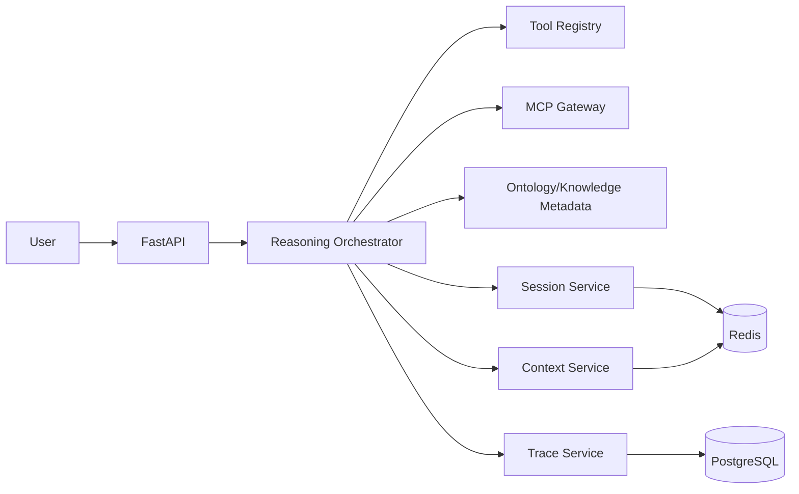

# Project_TheWorld M2 详细设计文档

## 1. 文档目标

M2 聚焦推理主链路可用化，完成从“用户输入”到“能力执行”的闭环，覆盖：

1. LangGraph 主会话编排链路
2. 歧义识别与澄清回路
3. 错误恢复（Reflexion）机制
4. 上下文作用域隔离与回传机制

## 2. M2 范围定义

### 2.1 In Scope

1. 推理状态机与节点实现（意图识别、能力匹配、执行、收敛）。
2. Clarification Node（多义意图主动提问）。
3. Error Recovery Node（失败观测、参数修正、路径重规划、重试）。
4. Context Scope（Global/Session/Local/Return Artifacts）存储与读写规范。
5. Tool Registry Top-K 工具筛选与按轮加载。
6. 推理过程日志埋点与 TraceID 贯穿。

### 2.2 Out of Scope（M3+）

1. 并行子会话大规模调度。
2. Data Virtualization（Text-to-SQL/Text-to-Request 统一执行）。
3. 链路可视化前端画布。
4. GraphRAG/Re-ranking/检索路由器。

## 3. 技术基线

1. `LangGraph + LangChain`
2. `FastAPI + Pydantic v2`
3. `PostgreSQL 16`
4. `Redis 7`
5. `Celery`（先用于异步补偿与重试任务，不启用复杂并行 DAG）
6. `OpenTelemetry`

## 4. 逻辑架构（M2）



## 5. 状态模型设计

### 5.1 AgentState（M2）

```python
class AgentState(TypedDict):
    request_id: str
    tenant_id: str
    user_id: str
    messages: list[dict]
    global_context: dict
    session_context: dict
    local_context: dict
    pending_tasks: list[dict]
    task_stack: list[str]
    selected_tools: list[dict]
    clarification_needed: dict | None
    recovery_state: dict | None
    return_artifacts: list[dict]
    final_response: dict | None
```

### 5.2 会话状态机

1. `CREATED`
2. `UNDERSTANDING`
3. `PLANNING`
4. `EXECUTING`
5. `WAITING_CLARIFICATION`
6. `RECOVERING`
7. `COMPLETED`
8. `FAILED`

## 6. LangGraph 节点设计

1. `N1_InputNormalize`：清洗输入、注入租户与用户上下文。
2. `N2_IntentExtract`：提取业务意图、实体、约束。
3. `N3_OntologyLocate`：调用 M1 元数据 MCP 接口定位候选本体与能力。
4. `N4_ToolSelect`：通过 Tool Registry 返回 Top-K 工具。
5. `N5_PlanBuild`：形成可执行计划（串行任务列表）。
6. `N6_ExecuteStep`：执行当前任务（MCP/能力调用）。
7. `N7_Clarify`：触发澄清问题并等待用户反馈后回流 `N5`。
8. `N8_Recovery`：失败后读取错误观测并重试或改道。
9. `N9_Finalize`：生成最终答复与可追踪工件。

路由规则：
1. 多义且置信度低于阈值 -> `N7_Clarify`。
2. 执行报错且可恢复 -> `N8_Recovery`。
3. 不可恢复或超重试上限 -> `FAILED`。
4. 全任务完成 -> `N9_Finalize`。

## 7. Context Service 详细设计

### 7.1 作用域约束

1. `Global Context`：租户配置、用户长期画像，主子会话可读。
2. `Session Context`：当前主会话共享上下文，跨轮次持久。
3. `Local Context`：单节点/单轮临时信息，不跨轮持久化。
4. `Return Artifacts`：可回传父流程的显式工件（结构化结果）。

### 7.2 读写策略

1. 节点读取优先级：`Local > Session > Global`。
2. 节点写入默认：`Local`；需升级必须显式标记 `promote=true`。
3. Context 压缩触发条件：轮次 > 12 或 token 估计 > 阈值。
4. 压缩结果必须保留：目标、约束、已完成工件、失败历史摘要。

## 8. API 设计（M2 新增）

1. `POST /api/v1/reasoning/sessions`
2. `GET /api/v1/reasoning/sessions/{session_id}`
3. `POST /api/v1/reasoning/sessions/{session_id}/messages`
4. `POST /api/v1/reasoning/sessions/{session_id}:clarify`
5. `POST /api/v1/reasoning/sessions/{session_id}:cancel`
6. `GET /api/v1/reasoning/sessions/{session_id}/trace`
7. `POST /api/v1/internal/tool-registry:select`

`/messages` 请求示例：

```json
{
  "content": "帮我定位昨天新增但未授信的企业客户",
  "stream": false
}
```

`/clarify` 请求示例：

```json
{
  "question_id": "q_001",
  "answer": "只看华东大区"
}
```

## 9. 数据模型（M2 新增）

1. `reasoning_session`
2. `reasoning_turn`
3. `reasoning_task`
4. `context_snapshot`
5. `recovery_event`
6. `return_artifact`
7. `trace_event`

关键字段：
1. `reasoning_session.status`：会话状态。
2. `reasoning_task.retry_count`：当前任务重试次数。
3. `context_snapshot.scope`：global/session/local/artifact。
4. `recovery_event.strategy`：retry/replan/fallback。
5. `trace_event.span_type`：llm/tool/mcp/context。

## 10. 错误恢复机制

1. 重试策略：`max_retry=2`，指数退避 `200ms/800ms`。
2. 参数修正：基于错误码自动补齐缺失参数或类型修正。
3. 路径切换：主能力失败时切换候选能力。
4. 降级策略：无可用能力时返回澄清问题或可执行建议。
5. 熔断策略：同一工具连续失败超过阈值，当前会话禁用该工具。

## 11. 测试设计

### 11.1 单元测试

1. 节点路由条件正确性。
2. Clarification 触发阈值逻辑。
3. Recovery 参数修正逻辑。
4. Context 读写与隔离规则。

### 11.2 集成测试

1. 输入 -> 定位 -> 执行 -> 输出全链路。
2. 歧义输入触发澄清并回流执行。
3. MCP 失败后恢复成功。
4. 长会话触发压缩后结果一致性。

### 11.3 性能基线（M2 验收）

1. 单轮推理 P95 < 2.5s（不含外部慢接口）。
2. 澄清回路恢复后成功率 > 90%。
3. Context 压缩耗时 P95 < 200ms。

## 12. M2 验收清单

1. 主链路状态机可运行并可观测。
2. 歧义澄清闭环可用。
3. 错误恢复机制可重复验证。
4. 上下文隔离与回传符合作用域约束。
5. 所有关键接口返回 `trace_id` 与标准错误码。
