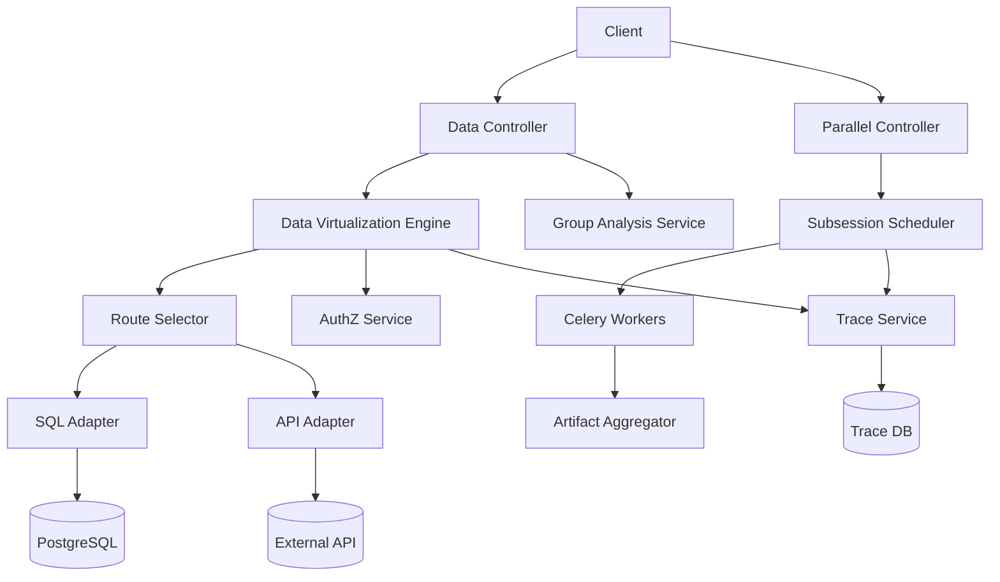

# M3 Architecture Spec

## 1. Scope

M3 only covers:
1. Data Virtualization (`execute_query`)
2. 分组分析接口（`group-analysis`）
3. 并行子会话调度与汇总
4. Trace 树增强
5. 权限强化（RBAC + 字段级）

## 2. Standard Tree

```text
Project_TheWorld/
├── src/
│   └── app/
│       ├── api/v1/
│       │   ├── data.py
│       │   ├── parallel_reasoning.py
│       │   ├── trace.py
│       │   └── authz.py
│       ├── services/
│       │   ├── data_virtualization_service.py
│       │   ├── group_analysis_service.py
│       │   ├── sql_adapter_service.py
│       │   ├── api_adapter_service.py
│       │   ├── subsession_scheduler_service.py
│       │   ├── trace_service.py
│       │   └── authz_service.py
│       ├── workers/
│       │   ├── subsession_worker.py
│       │   └── aggregate_worker.py
│       ├── repositories/
│       │   ├── virtual_query_repo.py
│       │   ├── subsession_repo.py
│       │   ├── trace_span_repo.py
│       │   └── auth_policy_repo.py
│       └── schemas/
│           ├── data_virtualization.py
│           ├── subsession.py
│           ├── trace.py
│           └── authz.py
├── tests/
│   ├── unit/
│   │   ├── test_virtualization_router.py
│   │   ├── test_sql_guardrail.py
│   │   └── test_field_level_masking.py
│   └── integration/
│       ├── test_execute_query_e2e.py
│       ├── test_parallel_subsession.py
│       └── test_trace_tree_consistency.py
└── requirements.txt
```

## 3. requirements.txt Dependency List

| Library | Version | Core Purpose |
|---|---:|---|
| fastapi | >=0.111,<1.0 | API 层 |
| sqlalchemy | >=2.0,<3.0 | DB 访问 |
| celery | >=5.4,<6.0 | 子会话并行任务 |
| redis | >=5.0,<6.0 | 队列与状态 |
| psycopg[binary] | >=3.1,<4.0 | PostgreSQL 驱动 |
| httpx | >=0.27,<1.0 | 外部 API 适配调用 |
| sqlparse | >=0.5,<1.0 | SQL 白名单校验辅助 |
| python-jose[cryptography] | >=3.3,<4.0 | 权限鉴权 |
| opentelemetry-api | >=1.25,<2.0 | Trace API |
| opentelemetry-sdk | >=1.25,<2.0 | Trace SDK |
| pytest | >=8.0,<9.0 | 测试框架 |

## 4. Logical Architecture



## 5. PEP 8 Rules

1. 模块文件名使用 `snake_case.py`
2. 服务类名使用 `PascalCase`
3. 适配器函数名使用 `snake_case`
4. 权限常量使用 `UPPER_SNAKE_CASE`
