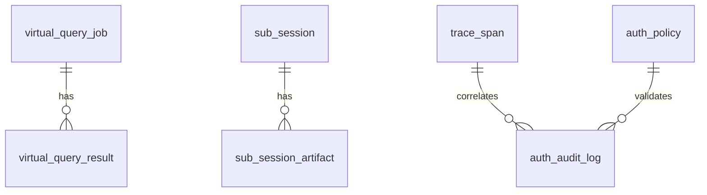

# M3 Database Design

## 1. Scope

M3 DB focuses on virtualization jobs, sub-session management, trace span tree, and auth policy.

## 2. Table Definitions (DDL View)

### 2.1 virtual_query_job

| Field | Data Type | Constraint | Default | Comment |
|---|---|---|---|---|
| id | BIGSERIAL | PK | - | 主键 |
| job_id | VARCHAR(64) | NN, Unique | - | 作业 ID |
| tenant_id | VARCHAR(64) | NN | - | 租户 |
| ontology_id | BIGINT | NN | - | 本体 ID |
| route_type | VARCHAR(16) | NN | - | sql/api |
| status | VARCHAR(32) | NN | 'PENDING' | 状态 |
| request_json | JSONB | NN | - | 请求参数 |
| created_at | TIMESTAMP | NN | now() | 创建时间 |

### 2.2 virtual_query_result

| Field | Data Type | Constraint | Default | Comment |
|---|---|---|---|---|
| id | BIGSERIAL | PK | - | 主键 |
| job_id | VARCHAR(64) | FK -> virtual_query_job.job_id, NN | - | 作业 ID |
| page_no | INTEGER | NN | 1 | 页码 |
| rows_json | JSONB | NN | - | 行数据 |
| schema_json | JSONB | NN | - | 结构定义 |
| next_page_token | VARCHAR(128) | - | NULL | 翻页令牌 |
| created_at | TIMESTAMP | NN | now() | 创建时间 |

### 2.3 sub_session

| Field | Data Type | Constraint | Default | Comment |
|---|---|---|---|---|
| id | BIGSERIAL | PK | - | 主键 |
| sub_session_id | VARCHAR(64) | NN, Unique | - | 子会话 ID |
| parent_session_id | VARCHAR(64) | NN | - | 父会话 ID |
| status | VARCHAR(32) | NN | 'CREATED' | 状态 |
| task_json | JSONB | NN | - | 子任务描述 |
| created_at | TIMESTAMP | NN | now() | 创建时间 |

### 2.4 sub_session_artifact

| Field | Data Type | Constraint | Default | Comment |
|---|---|---|---|---|
| id | BIGSERIAL | PK | - | 主键 |
| sub_session_id | VARCHAR(64) | FK -> sub_session.sub_session_id, NN | - | 子会话 ID |
| artifact_type | VARCHAR(32) | NN | - | result/metric/index |
| artifact_json | JSONB | NN | - | 工件内容 |
| created_at | TIMESTAMP | NN | now() | 创建时间 |

### 2.5 trace_span

| Field | Data Type | Constraint | Default | Comment |
|---|---|---|---|---|
| id | BIGSERIAL | PK | - | 主键 |
| trace_id | VARCHAR(64) | NN | - | 链路 ID |
| span_id | VARCHAR(64) | NN, Unique | - | Span ID |
| parent_span_id | VARCHAR(64) | - | NULL | 父 Span |
| session_id | VARCHAR(64) | NN | - | 会话 ID |
| span_type | VARCHAR(32) | NN | - | planner/subsession/virtualization/authz |
| started_at | TIMESTAMP | NN | - | 开始时间 |
| ended_at | TIMESTAMP | - | NULL | 结束时间 |

### 2.6 auth_policy

| Field | Data Type | Constraint | Default | Comment |
|---|---|---|---|---|
| id | BIGSERIAL | PK | - | 主键 |
| tenant_id | VARCHAR(64) | NN | - | 租户 |
| subject_type | VARCHAR(16) | NN | - | user/role |
| subject_id | VARCHAR(64) | NN | - | 主体 ID |
| resource | VARCHAR(128) | NN | - | 资源 |
| action | VARCHAR(32) | NN | - | 动作 |
| field_name | VARCHAR(128) | - | NULL | 字段级控制 |
| effect | VARCHAR(16) | NN | - | allow/deny/mask |
| created_at | TIMESTAMP | NN | now() | 创建时间 |

### 2.7 auth_audit_log

| Field | Data Type | Constraint | Default | Comment |
|---|---|---|---|---|
| id | BIGSERIAL | PK | - | 主键 |
| trace_id | VARCHAR(64) | NN | - | 链路 ID |
| auth_policy_id | BIGINT | FK -> auth_policy.id | NULL | 命中策略 ID |
| subject_id | VARCHAR(64) | NN | - | 主体 |
| resource | VARCHAR(128) | NN | - | 资源 |
| action | VARCHAR(32) | NN | - | 动作 |
| decision | VARCHAR(16) | NN | - | allow/deny/mask |
| masked_fields | JSONB | - | '[]'::jsonb | 脱敏字段 |
| created_at | TIMESTAMP | NN | now() | 创建时间 |

## 3. Entity Relationship Diagram

## 4. CRUD Permission Matrix

| Module | virtual_query_job | virtual_query_result | sub_session | sub_session_artifact | trace_span | auth_policy | auth_audit_log |
|---|---|---|---|---|---|---|---|
| DataVirtualizationModule | C/R/U | C/R/U | - | - | R | R | R |
| ParallelSessionModule | - | - | C/R/U | C/R/U | R | - | - |
| TraceModule | R | R | R | R | C/R/U | R | C/R/U |
| AuthzModule | - | - | - | - | R | C/R/U/D | C/R |
| APIQueryModule | R | R | R | R | R | R | R |
