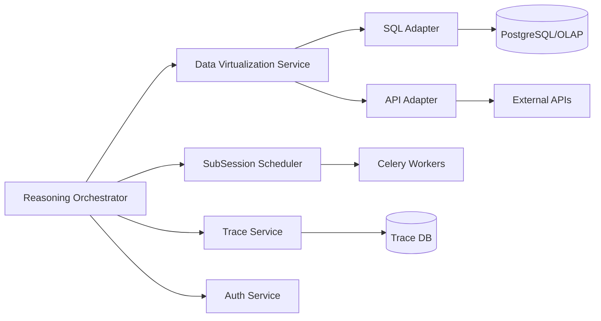

# Project_TheWorld M3 详细设计文档

## 1. 文档目标

M3 聚焦“可执行能力增强与生产级并发能力”，覆盖：

1. Data Virtualization（SQL/API 统一执行）
2. 并行子会话调度与汇总
3. 链路追踪可视化数据面
4. 权限强化（RBAC + 字段级控制）

## 2. M3 范围定义

### 2.1 In Scope

1. `execute_query(ontology_id, constraints)` 统一执行接口。
2. SQL Adapter 与 API Adapter 双执行通道。
3. 主会话拆分子任务并行执行与结果聚合。
4. Trace Service 增强：会话树、节点耗时、MCP 调用明细。
5. 权限强化：资源级、字段级、动作级鉴权。

### 2.2 Out of Scope（M4）

1. GraphRAG 关系增强检索。
2. Re-ranking 深度重排。
3. Retrieval Router（多检索引擎智能路由）。
4. 高级观测平台深度集成（LangSmith/Phoenix 全量能力）。

## 3. 架构设计（M3）



## 4. Data Virtualization 详细设计

### 4.1 统一接口

1. `execute_query(ontology_id, constraints, projection, pagination, auth_ctx)`
2. 输入由 M2 计划节点产出，输出统一为 `rows + schema + lineage`。

### 4.2 路由规则

1. 本体绑定为 `table` -> SQL Adapter。
2. 本体绑定为 `api` -> API Adapter。
3. 同本体多绑定时按策略优先级选择（默认 table > api）。
4. 路由失败返回可恢复错误给 Recovery Node。

### 4.3 SQL Adapter

1. Text-to-SQL 仅在白名单模板内生成。
2. 强制注入租户过滤与权限过滤谓词。
3. 只允许 `SELECT`，禁止 DML/DDL。
4. 结果集超限时自动分页并输出 continuation token。

### 4.4 API Adapter

1. Text-to-Request 将语义约束映射为接口参数。
2. 绑定配置支持 `endpoint/method/timeout/retry/auth_mapping`。
3. 响应映射到统一数据契约（列名、类型、单位、时区）。

## 5. 并行子会话设计

### 5.1 拆分策略

1. 按任务独立性拆分（实体互不依赖）。
2. 按数据源拆分（不同系统可并行）。
3. 按时间窗口拆分（分区并行聚合）。

### 5.2 调度与生命周期

1. 主会话创建 `sub_session` 并派发到 Worker。
2. 子会话继承 `Global + Session` 只读上下文。
3. 子会话写 `Local`，仅通过 `Return Artifacts` 回传。
4. 主会话等待所有子会话完成或超时后聚合。

### 5.3 聚合策略

1. 结构化合并（同 schema union）。
2. 指标聚合（sum/avg/max/min/count）。
3. 冲突解决（按来源优先级与时间戳选择）。

## 6. Trace Service 增强

1. 会话树结构：主会话与子会话关联。
2. Span 类型扩展：`planner`, `subsession`, `virtualization`, `authz`。
3. 关键指标：节点耗时、重试次数、错误率、工具成功率。
4. 提供查询接口：按 `trace_id/session_id/user_id/time_range` 检索。

接口：
1. `GET /api/v1/trace/sessions/{session_id}/tree`
2. `GET /api/v1/trace/spans?trace_id=...`
3. `GET /api/v1/trace/metrics/summary`

## 7. 权限强化设计

1. RBAC：角色到动作映射（query/read/export/admin）。
2. 资源级：本体、能力、工具、数据源访问控制。
3. 字段级：敏感字段脱敏/拒绝返回（如证件号、手机号）。
4. 审计日志：记录主体、资源、动作、结果、原因。

## 8. API 设计（M3 新增）

1. `POST /api/v1/data/execute-query`
2. `POST /api/v1/reasoning/sessions/{id}:parallel-run`
3. `GET /api/v1/reasoning/sessions/{id}/artifacts`
4. `GET /api/v1/trace/sessions/{id}/tree`
5. `POST /api/v1/authz/check`

`/data/execute-query` 示例：

```json
{
  "ontology_id": 30012,
  "constraints": {
    "region": "华东",
    "created_at": { "gte": "2026-02-01", "lte": "2026-02-12" }
  },
  "projection": ["customer_id", "customer_name", "credit_status"],
  "pagination": { "page": 1, "page_size": 100 }
}
```

## 9. 数据模型（M3 新增）

1. `virtual_query_job`
2. `virtual_query_result`
3. `sub_session`
4. `sub_session_artifact`
5. `trace_span`
6. `auth_policy`
7. `auth_audit_log`

关键字段：
1. `virtual_query_job.route_type`：sql/api。
2. `sub_session.parent_session_id`：父子关系。
3. `trace_span.parent_span_id`：链路层级。
4. `auth_policy.effect`：allow/deny。
5. `auth_audit_log.masked_fields`：脱敏字段列表。

## 10. 测试设计

### 10.1 单元测试

1. 路由器正确选择 SQL/API Adapter。
2. SQL 安全护栏（仅 SELECT、租户谓词注入）。
3. 子会话上下文隔离与回传约束。
4. 字段级权限过滤与脱敏逻辑。

### 10.2 集成测试

1. table/api 双绑定本体的统一执行闭环。
2. 并行 10 子会话聚合结果一致性。
3. Trace 树与实际执行路径一致性。
4. 权限拒绝场景下错误码与审计记录正确性。

### 10.3 性能基线（M3 验收）

1. 并行 20 子会话调度成功率 > 99%。
2. `execute-query` P95 < 1.5s（单源、10 万数据量）。
3. Trace 查询 P95 < 300ms。
4. 鉴权检查开销 < 50ms。

## 11. M3 验收清单

1. Data Virtualization 统一接口可用并可观测。
2. 主子会话并行调度稳定。
3. Trace 树可完整回放执行路径。
4. RBAC + 字段级权限在查询链路生效。
5. 审计日志可追责可检索。
