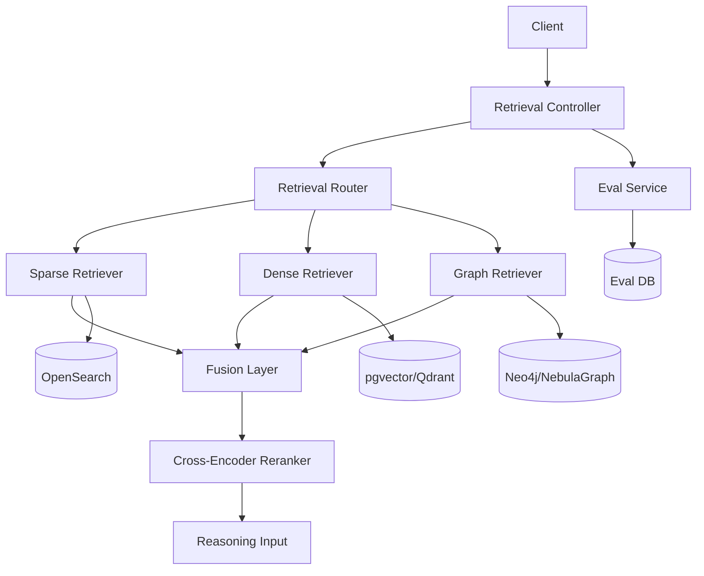

# M4 Architecture Spec

## 1. Scope

M4 only covers:
1. GraphRAG 检索增强
2. Re-ranking 重排
3. Retrieval Router 路由
4. 检索质量评估与可观测增强

## 2. Standard Tree

```text
Project_TheWorld/
├── src/
│   └── app/
│       ├── api/v1/
│       │   ├── retrieval.py
│       │   └── eval.py
│       ├── retrieval/
│       │   ├── router.py
│       │   ├── sparse_retriever.py
│       │   ├── dense_retriever.py
│       │   ├── graph_retriever.py
│       │   ├── fusion.py
│       │   └── reranker.py
│       ├── graph/
│       │   ├── graph_builder.py
│       │   └── graph_store_client.py
│       ├── observability/
│       │   ├── quality_metrics.py
│       │   └── replay_service.py
│       ├── repositories/
│       │   ├── retrieval_log_repo.py
│       │   ├── router_decision_repo.py
│       │   └── eval_repo.py
│       └── schemas/
│           ├── retrieval.py
│           └── eval.py
├── tests/
│   ├── unit/
│   │   ├── test_router_strategy.py
│   │   ├── test_graph_retrieval_khop.py
│   │   └── test_rerank_fallback.py
│   └── integration/
│       ├── test_hybrid_retrieval_e2e.py
│       └── test_eval_job_pipeline.py
└── requirements.txt
```

## 3. requirements.txt Dependency List

| Library | Version | Core Purpose |
|---|---:|---|
| fastapi | >=0.111,<1.0 | 检索与评估 API |
| sqlalchemy | >=2.0,<3.0 | 日志与评估数据存储 |
| pgvector | >=0.2,<1.0 | 向量检索支持 |
| elasticsearch | >=8.0,<9.0 | 关键词检索 |
| neo4j | >=5.0,<6.0 | 图谱存储访问（GraphRAG） |
| sentence-transformers | >=3.0,<4.0 | 向量编码 |
| transformers | >=4.0,<5.0 | Cross-Encoder 重排 |
| numpy | >=1.26,<3.0 | 检索打分计算 |
| opentelemetry-api | >=1.25,<2.0 | 可观测埋点 |
| opentelemetry-sdk | >=1.25,<2.0 | 观测数据导出 |
| pytest | >=8.0,<9.0 | 测试框架 |

## 4. Logical Architecture



## 5. PEP 8 Rules

1. 检索器模块使用 `snake_case.py`
2. 路由策略类使用 `PascalCase`
3. 策略函数使用 `snake_case`
4. 指标常量使用 `UPPER_SNAKE_CASE`
