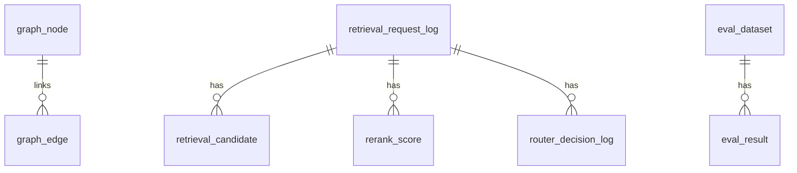

# M4 Database Design

## 1. Scope

M4 DB focuses on retrieval path logging, graph elements, rerank scores, router decisions, and evaluation data.

## 2. Table Definitions (DDL View)

### 2.1 graph_node

| Field | Data Type | Constraint | Default | Comment |
|---|---|---|---|---|
| id | BIGSERIAL | PK | - | 主键 |
| tenant_id | VARCHAR(64) | NN | - | 租户 |
| node_type | VARCHAR(32) | NN | - | class/attribute/relation/capability/entity |
| node_ref_id | VARCHAR(64) | NN | - | 业务对象 ID |
| node_name | VARCHAR(256) | NN | - | 节点名称 |
| weight | NUMERIC(8,4) | - | 1.0 | 权重 |
| created_at | TIMESTAMP | NN | now() | 创建时间 |

### 2.2 graph_edge

| Field | Data Type | Constraint | Default | Comment |
|---|---|---|---|---|
| id | BIGSERIAL | PK | - | 主键 |
| tenant_id | VARCHAR(64) | NN | - | 租户 |
| source_node_id | BIGINT | FK -> graph_node.id, NN | - | 起点 |
| target_node_id | BIGINT | FK -> graph_node.id, NN | - | 终点 |
| edge_type | VARCHAR(32) | NN | - | INHERITS/HAS_ATTRIBUTE/HAS_RELATION/HAS_CAPABILITY/REFERS_TO |
| weight | NUMERIC(8,4) | - | 1.0 | 边权 |
| created_at | TIMESTAMP | NN | now() | 创建时间 |

### 2.3 retrieval_request_log

| Field | Data Type | Constraint | Default | Comment |
|---|---|---|---|---|
| id | BIGSERIAL | PK | - | 主键 |
| request_id | VARCHAR(64) | NN, Unique | - | 请求 ID |
| tenant_id | VARCHAR(64) | NN | - | 租户 |
| query_text | TEXT | NN | - | 查询文本 |
| route_type | VARCHAR(16) | NN | - | sql/sparse/dense/graph/hybrid |
| created_at | TIMESTAMP | NN | now() | 创建时间 |

### 2.4 retrieval_candidate

| Field | Data Type | Constraint | Default | Comment |
|---|---|---|---|---|
| id | BIGSERIAL | PK | - | 主键 |
| request_id | VARCHAR(64) | FK -> retrieval_request_log.request_id, NN | - | 请求 ID |
| source | VARCHAR(16) | NN | - | sparse/dense/graph |
| doc_ref_id | VARCHAR(64) | NN | - | 候选对象 ID |
| recall_score | NUMERIC(10,6) | NN | - | 召回得分 |
| rank_no | INTEGER | NN | - | 初筛排名 |
| created_at | TIMESTAMP | NN | now() | 创建时间 |

### 2.5 rerank_score

| Field | Data Type | Constraint | Default | Comment |
|---|---|---|---|---|
| id | BIGSERIAL | PK | - | 主键 |
| request_id | VARCHAR(64) | FK -> retrieval_request_log.request_id, NN | - | 请求 ID |
| doc_ref_id | VARCHAR(64) | NN | - | 文档 ID |
| model_version | VARCHAR(64) | NN | - | 重排模型版本 |
| score | NUMERIC(10,6) | NN | - | 重排分数 |
| rank_no | INTEGER | NN | - | 重排后排名 |
| created_at | TIMESTAMP | NN | now() | 创建时间 |

### 2.6 router_decision_log

| Field | Data Type | Constraint | Default | Comment |
|---|---|---|---|---|
| id | BIGSERIAL | PK | - | 主键 |
| request_id | VARCHAR(64) | FK -> retrieval_request_log.request_id, NN | - | 请求 ID |
| strategy | VARCHAR(64) | NN | - | 路由策略标识 |
| route_type | VARCHAR(16) | NN | - | sql/sparse/dense/graph/hybrid |
| weight_json | JSONB | NN | - | 通道权重 |
| enable_rerank | BOOLEAN | NN | true | 是否启用重排 |
| created_at | TIMESTAMP | NN | now() | 创建时间 |

### 2.7 eval_dataset

| Field | Data Type | Constraint | Default | Comment |
|---|---|---|---|---|
| id | BIGSERIAL | PK | - | 主键 |
| dataset_id | VARCHAR(64) | NN, Unique | - | 数据集 ID |
| tenant_id | VARCHAR(64) | NN | - | 租户 |
| name | VARCHAR(256) | NN | - | 数据集名称 |
| meta_json | JSONB | - | '{}'::jsonb | 元信息 |
| created_at | TIMESTAMP | NN | now() | 创建时间 |

### 2.8 eval_result

| Field | Data Type | Constraint | Default | Comment |
|---|---|---|---|---|
| id | BIGSERIAL | PK | - | 主键 |
| dataset_id | VARCHAR(64) | FK -> eval_dataset.dataset_id, NN | - | 数据集 ID |
| job_id | VARCHAR(64) | NN | - | 任务 ID |
| strategy | VARCHAR(64) | NN | - | 策略标识 |
| metric_json | JSONB | NN | - | 指标结果 |
| created_at | TIMESTAMP | NN | now() | 创建时间 |

## 3. Entity Relationship Diagram

## 4. CRUD Permission Matrix

| Module | graph_node | graph_edge | retrieval_request_log | retrieval_candidate | rerank_score | router_decision_log | eval_dataset | eval_result |
|---|---|---|---|---|---|---|---|---|
| GraphRAGModule | C/R/U/D | C/R/U/D | - | - | - | - | - | - |
| RetrievalModule | R | R | C/R | C/R | C/R | C/R | R | R |
| RerankModule | - | - | R | R | C/R/U | R | - | - |
| RouterModule | - | - | R | R | R | C/R/U | - | - |
| EvalModule | - | - | R | R | R | R | C/R/U/D | C/R/U/D |
| APIQueryModule | R | R | R | R | R | R | R | R |
