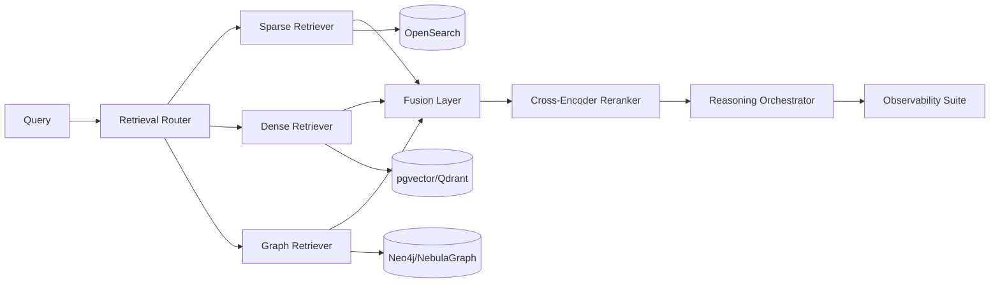

# Project_TheWorld M4 详细设计文档（增强阶段）

## 1. 文档目标

M4 为可选增强阶段，目标是显著提升检索质量、跨本体推理能力与可观测深度，覆盖：

1. GraphRAG（关系图增强检索）
2. Re-ranking（Cross-Encoder 重排）
3. Retrieval Router（多检索路径智能路由）
4. 高级可观测能力（质量评估、回放、对比实验）

## 2. M4 范围定义

### 2.1 In Scope

1. 本体关系图构建与图检索召回。
2. Dense/Sparse/Graph 多路召回融合。
3. Cross-Encoder 重排服务。
4. 查询路由器（SQL、关键词、向量、图检索路径选择）。
5. 在线评估指标与离线评测任务。

### 2.2 Out of Scope

1. 业务前端 UI 大改造。
2. 非检索链路的模型训练平台建设。

## 3. 架构设计（M4）



## 4. GraphRAG 详细设计

### 4.1 图谱建模

1. 节点：`OntologyClass`, `Attribute`, `Relation`, `Capability`, `EntitySample`。
2. 边：`INHERITS`, `HAS_ATTRIBUTE`, `HAS_RELATION`, `HAS_CAPABILITY`, `REFERS_TO`。
3. 边权：基于共现频率、业务规则强度、人工置信度。

### 4.2 图召回流程

1. 从 query 抽取实体与约束。
2. 定位起始节点（属性/本体）。
3. 进行 K-Hop 遍历（默认 2-Hop）。
4. 返回路径证据（path evidence）与候选能力。

## 5. Re-ranking 详细设计

1. 初筛候选由 Sparse/Dense/Graph 召回提供（Top 100）。
2. Cross-Encoder 对 query-doc 对打分。
3. 输出 Top-K（默认 20）进入推理节点。
4. 降级策略：重排超时时回退到融合排序结果。

## 6. Retrieval Router 详细设计

### 6.1 路由输入特征

1. 查询意图类型（统计、详情、关系推断、问答）。
2. 结构化程度（是否包含明确字段与时间范围）。
3. 历史命中效果（在线反馈）。
4. 成本预算（延迟与 token）。

### 6.2 路由输出

1. 路径选择：`sql` / `sparse` / `dense` / `graph` / `hybrid`。
2. 召回配比：各通道 Top-K 与权重。
3. 是否启用重排。

## 7. 可观测与评估增强

1. 在线指标：`Answer Success`, `Tool Success`, `Clarify Rate`, `Recovery Rate`, `Latency`。
2. 检索指标：`Recall@K`, `MRR`, `nDCG@K`。
3. 质量回放：同 query 多策略 A/B 对比。
4. 失败分析：按错误类型聚类（路由错选、召回不足、重排误杀）。

## 8. API 设计（M4 新增）

1. `POST /api/v1/retrieval/search`
2. `POST /api/v1/retrieval/route`
3. `POST /api/v1/retrieval/rerank`
4. `GET /api/v1/retrieval/explain/{request_id}`
5. `POST /api/v1/eval/jobs`
6. `GET /api/v1/eval/jobs/{job_id}`

`/retrieval/search` 示例：

```json
{
  "query": "关联企业近30天授信变化与交易波动",
  "top_k": 20,
  "enable_graph": true,
  "enable_rerank": true
}
```

## 9. 数据模型（M4 新增）

1. `graph_node`
2. `graph_edge`
3. `retrieval_request_log`
4. `retrieval_candidate`
5. `rerank_score`
6. `router_decision_log`
7. `eval_dataset`
8. `eval_result`

关键字段：
1. `router_decision_log.strategy`：路由策略版本。
2. `retrieval_candidate.source`：sparse/dense/graph。
3. `rerank_score.model_version`：重排模型版本。
4. `eval_result.metric_json`：评估指标明细。

## 10. 测试设计

### 10.1 单元测试

1. 图遍历边界与环路控制。
2. 路由策略规则正确性。
3. 重排超时降级逻辑。
4. 召回融合权重计算。

### 10.2 集成测试

1. Hybrid 检索链路端到端正确性。
2. 图检索增强对跨本体问题有效性。
3. A/B 策略切换不影响主链路可用性。
4. Explain 接口可还原路由与召回证据。

### 10.3 性能与质量基线（M4 验收）

1. 检索端到端 P95 < 1.2s（不含生成）。
2. 与 M3 对比 `Recall@20` 提升 >= 12%。
3. 复杂关联问题首答正确率提升 >= 10%。
4. 重排超时降级成功率 100%。

## 11. M4 验收清单

1. GraphRAG、Re-ranking、Router 可独立开关。
2. 检索质量指标可持续采集并可追溯。
3. Explain 能力可解释路由、召回与重排结果。
4. 关键增强能力具备回退策略，不影响主链路稳定性。
