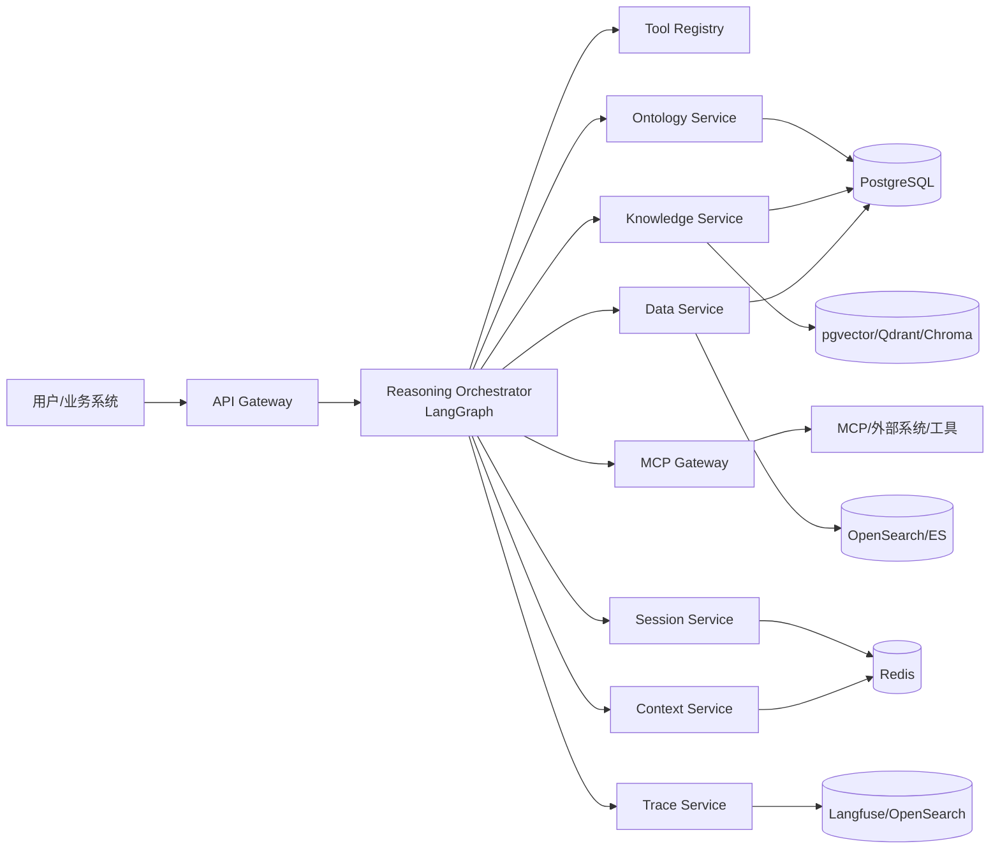
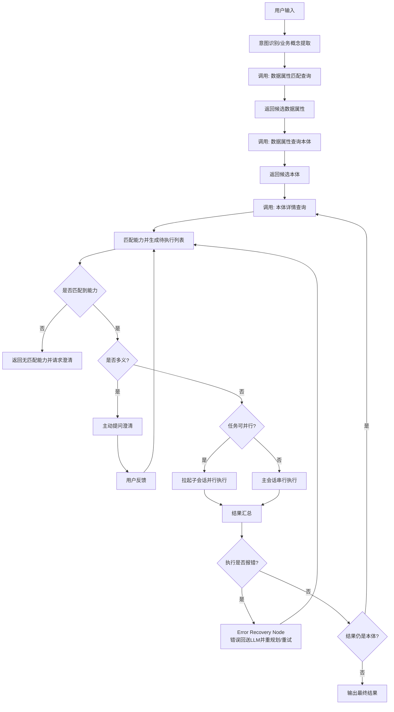
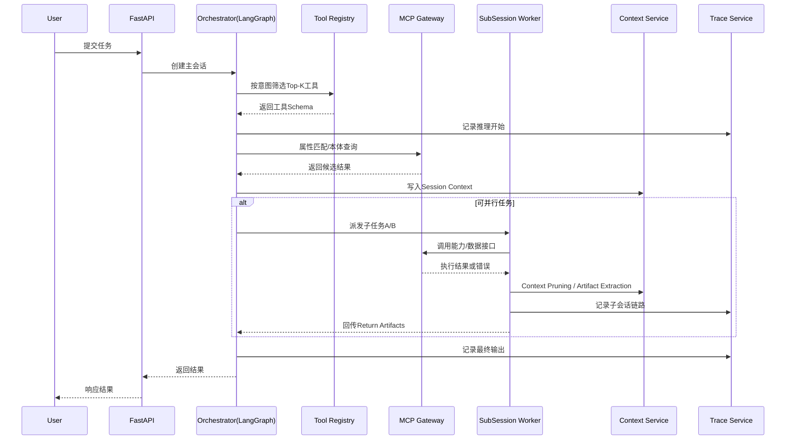

# Project_TheWorld 概要设计文档（Python 版）

## 1. 设计目标

基于需求清单，构建“本体驱动的 AI 操作系统”，核心目标：

1. 建立统一的本体建模与知识管理体系（本体、属性、关系、能力）。
2. 通过推理引导框架，将用户意图映射到本体能力并自动执行。
3. 支持多会话并行/递归执行、上下文隔离共享、记忆压缩。
4. 提供完整推理链路追踪（模型调用、MCP 调用、会话生命周期、上下文变更）。

## 2. 技术选型（Python）

1. 语言与运行时：`Python 3.11`
2. Web 框架：`FastAPI`
3. 推理编排框架：`LangGraph + LangChain`
4. 数据模型与校验：`Pydantic v2`
5. 数据库：`PostgreSQL 16`
6. 缓存与会话状态：`Redis 7`
7. 异步任务/并行执行：`Celery + Redis/RabbitMQ`
8. 向量检索：`pgvector`（首选），`Qdrant / Chroma`（备选）
9. 检索引擎：`Elasticsearch / OpenSearch`
10. 检索策略：`Hybrid Search (BM25/Sparse + Dense Vector + Rerank)`
11. 可观测性：`OpenTelemetry + Prometheus + Grafana`
12. 链路与日志：`Langfuse / LangSmith / Arize Phoenix（或 OpenSearch + Kibana）`
13. 身份权限：`Keycloak / Auth0 + RBAC`

## 3. 框架选型与关键实现

1. `LangGraph`：适配“主会话-子会话-递归任务”图式编排，支持有状态循环与条件分支。
2. `LangChain`：统一模型调用、工具调用、提示词模板与结构化输出。
3. `FastAPI`：提供高性能 API 与 OpenAPI 文档。
4. `Pydantic`：作为约束护栏，强制校验 LLM 输出参数（格式、必填、枚举、范围）。
5. 推理模式：采用 `ReAct (Reason + Act)` 作为基础执行回路，结合 `Plan-and-Solve` 先规划后执行。
6. 状态机模式：以 `FSM` 显式定义状态流转（待执行、执行中、待澄清、错误恢复、完成）。
7. 错误自愈：引入 `Reflexion` 策略，MCP 失败时基于错误观察修正参数并重试。

### 3.1 Tool Registry 与动态加载（需求 2.3）

1. 在 `reasoning-orchestrator` 与 `mcp-gateway` 之间增加 `tool-registry`。
2. 每轮会话先执行轻量 `tool-selector`，根据意图从全量工具中筛选 Top-K 工具。
3. 仅向当前轮注入 Top-K 工具 JSON Schema，控制上下文长度与误调用率。
4. 支持工具沙箱策略：超时、配额、白名单、租户隔离。

### 3.2 LangGraph State 定义（需求 2.4/2.5）

```python
class AgentState(TypedDict):
    messages: list
    global_context: dict
    session_context: dict
    local_context: dict
    task_stack: list[str]
    pending_tasks: list[dict]
    clarification_needed: str | None
    last_error: dict | None
    return_artifacts: list[dict]
```

## 4. 模块划分

1. `api-gateway`：统一入口、鉴权、限流、请求路由。
2. `ontology-service`：本体 CRUD、继承关系、属性/关系/能力定义。
3. `knowledge-service`：知识录入管理、Prompt 模板管理、`few-shot-retriever`（少样本向量检索）。
4. `reasoning-orchestrator`：意图识别、能力匹配、任务分解、并行/递归执行、歧义澄清与错误恢复。
5. `tool-registry`：动态工具注册、筛选、加载与沙箱治理。
6. `mcp-gateway`：统一 MCP 注册、发现、调用、重试与错误标准化。
7. `data-service`：条件查询、分组分析、分页加载、`interface-adaptor`、`data-virtualization`、`hybrid-retrieval-engine`。
8. `session-service`：主会话/子会话生命周期管理、父子关系维护。
9. `context-service`：上下文存储、隔离共享、回传合并、记忆压缩。
10. `trace-service`：推理日志、MCP 调用日志、链路可视化。
11. `auth-service`：权限模型、资源访问控制。
12. `retrieval-router`（可选）：基于 `LlamaIndex RouterQueryEngine` 的路由层，按问题自动选择 SQL/关键词/向量检索路径。

## 5. 系统架构图



## 6. 功能清单（对齐需求）

1. 本体管理
- 本体增删改查。
- 数据属性、对象属性、能力定义。
- 继承关系管理（子本体继承父本体属性/关系/能力）。
- 物理表映射与接口绑定。

2. 本体能力
- 关系能力：起点本体 -> 终点本体（多对多）。
- 实体能力：本体内动作执行并直接返回结果。
- `Parameter Extraction Agent`：将自然语言转换为非标准 API/Skill 的 JSON 入参并做结构校验。

3. 知识框架
- 本体 Class 知识：概述、约束、关系、能力。
- 数据属性知识：属性说明、属性约束。
- 关系知识：提示词模板 + MCP 绑定。
- 能力知识：提示词模板 + MCP 绑定。
- Few-shot 策略：样本向量化存储，Prompt 构建时动态检索 Top-N 示例注入。
- 录入规范：意图描述 + 少样本示例 + JSON Schema。

4. 推理框架
- 系统级 MCP：属性匹配、本体查询、本体详情、关系/能力详情。
- 数据获取能力：条件查询、分组分析、分页与递进式加载。
- 混合检索：关键词+向量+重排，避免语义近似但业务不一致的问题。
- 推理引导：意图识别 -> 本体定位 -> 能力匹配 -> 执行 -> 递归闭环。
- 能力动态加载：按当前会话涉及本体动态加载工具。
- 会话管理：主会话/子会话、并行执行、错误回送。
- 上下文管理：存储、隔离共享、传递、记忆压缩。
- 链路追踪：推理日志、MCP 调用日志、路径展示。

5. 数据虚拟化（需求 2.1）
- SQL 模式：面向物理表本体，Text-to-SQL。
- API 模式：面向接口绑定本体，Text-to-Request。
- 统一执行接口：`execute_query(ontology_id, constraints)`。

6. 高级检索增强（可选）
- GraphRAG：结合本体关系图提高跨实体关联召回精度。
- Re-ranking：对初筛候选进行 Cross-Encoder 重排，提升 Top-K 质量。
- 图数据库支撑：可选 `Neo4j / NebulaGraph` 支持关系遍历与路径查询。

## 7. 关键功能流程图（推理引导）



## 8. 关键时序图（主子会话 + MCP）



## 9. 逻辑架构分层

1. 接入层：API Gateway、鉴权、限流。
2. 编排层：LangGraph 工作流（意图、路由、调度、递归）。
3. 能力层：Ontology/Knowledge/MCP/Data/Tool Registry。
4. 约束护栏层：Constraint Guardrails（Pydantic Schema 校验、业务规则校验）。
5. 状态层：Session/Context/Memory。
6. 可观测层：Trace/Logs/Metrics。
7. 存储层：PostgreSQL、Redis、Vector、Search。

## 10.1 推理工作流模式补充

1. `ReAct Loop`：Observation -> Reasoning -> Action(MCP/Tool) -> Observation。
2. `Plan-and-Solve`：先形成待执行计划，再进入任务级执行。
3. `Reflexion Recovery`：调用失败后将错误作为观察输入，触发参数修正或路径切换。
4. `Async/Event-Driven`：主会话通过事件驱动拉起子会话并并行汇总。

## 11. 上下文作用域与记忆策略

1. `Global Context`：用户画像、租户配置、全局本体索引（全会话可见）。
2. `Session Context`：主会话任务态信息（父传子，只读）。
3. `Local Context`：子会话私有推理过程（不回传父会话）。
4. `Return Artifacts`：子会话显式回传结果（本体、实例、分析结论）。
5. 记忆压缩：轮次阈值触发摘要，仅保留索引与关键工件，清理低价值中间内容。

## 12. 非功能设计要点

1. 并发与伸缩：无状态服务 + Worker 水平扩展。
2. 稳定性：MCP 调用超时、重试、熔断、降级、错误回送再规划。
3. 安全性：多租户隔离、字段级权限控制、审计日志。
4. 可追踪性：全链路 TraceID 贯穿用户请求、会话、MCP 调用。
5. 成本控制：上下文裁剪、动态工具装卸载、按需检索 Few-shot。

## 13. 分阶段实施建议

1. `M1`：本体管理 + 知识框架 + 系统级 MCP 元数据查询接口 + Hybrid Search。
2. `M2`：LangGraph 推理主链路 + 歧义澄清 + 错误恢复 + 上下文作用域隔离。
3. `M3`：Data Virtualization（SQL/API 统一执行）+ 并行子会话 + 链路可视化 + 权限强化。
4. `M4`（可选增强）：GraphRAG + Re-ranking + 检索路由器（LlamaIndex）+ 高级可观测工具（LangSmith/Phoenix）。

## 14. 需求 1.3/1.6 对齐补充（优先级覆盖前文冲突）

说明：如与前文冲突，以本节为准。

1. 知识框架结构（对齐 1.3）
- 本体 Class 知识拆分为：`overview`、`constraints`、`object_property_skill_desc`、`capability_skill_desc`。
- 数据属性知识拆分为：`definition`、`constraints`，并保留同义词与术语说明。
- 对象属性知识与本体能力知识均采用统一结构：`intent_desc + few_shot_examples + json_schema + skill_md + prompt_template + mcp_bindings`。
- 录入端必须提供“意图描述 + 少样本示例 + JSON Schema”的引导校验，避免仅靠长段自由文本。

2. 本体模型标准化（对齐 1.6）
- 本体系统以 OWL 为标准元模型：
  - 本体 = `owl:Class`
  - 数据属性 = `owl:DatatypeProperty`（全局声明，按本体引用）
  - 对象属性 = `owl:ObjectProperty`（全局声明，`domain/range` 支持多本体）
  - 本体能力 = 自定义扩展标签（Action 元数据）可挂载本体或独立存在
- 新增 OWL 导出能力：支持生成标准 OWL 文件（RDF/XML 或 Turtle），并可对接 RDF4J 等工具链。

3. 管理面设计（对齐 1.6）
- 本体管理页采用树状结构管理父子本体（增删改查）。
- 数据属性、对象属性、本体能力均需独立“全量管理页”。
- 本体详情页仅做关联查看与配置：引用哪些数据属性、关联哪些对象属性、挂载哪些能力。
- 本体关联表改为“一本体一张关联表”，并提供“数据属性 -> 表字段”映射配置。

4. 对 2.1/2.2 的知识框架符合性评估（结论）
- 评估结论：原设计“部分符合”，补充后“可满足”2.1/2.2 的推理与执行需求。
- 原主要缺口：
  - 关系/能力知识未强制结构化承载 `skill.md` 与可执行模板；
  - 数据属性为本体内字段而非全局声明，不利于 2.1 的跨本体属性匹配与聚合；
  - 缺少 OWL 规范与导出约束，导致跨系统语义一致性不足；
  - 本体关联表与字段映射约束不足，影响 2.1 条件查询/分组分析稳定落地。
- 补充后满足点：
  - 2.1 元数据查询可返回结构化知识（意图、模板、Schema、MCP 绑定）；
  - 2.2 推理链可基于“属性 -> 本体 -> 关系/能力执行细节”逐层拉取并递归执行；
  - 多义能力澄清可依赖能力知识中的意图与 few-shot 语义对比实现可解释决策。
